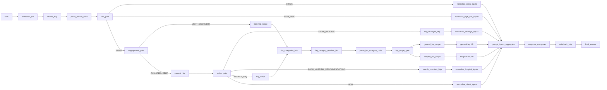

# Dify DSL 改造后逐 Node 分析

## 文档目的

这份文档不是单纯解释当前 `medora-ai-chatbot-v1.dsl.yml` 在做什么，而是基于我们已经确认的改造方向，说明 **改造后的 DSL / CRM backend / truth model 应该如何工作**。

文档重点回答 4 个问题：

1. Dify DSL 里每一个 node 改造后负责什么。
2. 哪些 node 会调用 backend，调用时每个 field 是什么语义。
3. backend 收到请求后，实际会走到哪些 route / use case / service / repository。
4. 这次状态收敛后，哪些字段会消失，哪些字段才是最终业务真相。

---

## 一、改造后的总体原则

### 1.1 最终真相只来自业务 truth

这次改造后，聊天系统不再信任以下会漂移的会话缓存字段：

- `pendingOffer`
- `pendingQuestion`
- `lastNextAction`
- `lastResolvedIntent`
- `leadMaturity`
- `prequalificationReasonCodes`
- `statusSnapshot.selectedHospitalId`

最终真相统一来自：

- case `structuredData.patientHospitalSelection`
- questionnaire response
- CHC / selected hospitals
- conversation / ai chat messages
- followup / handoff / timeline

### 1.2 允许保留的只有两类

- 路由/定位字段
  - `widgetChatTarget`
  - `formalConversationState`
- 摘要字段
  - `conversationSummary`

`conversationSummary` 只是摘要缓存，不是 source of truth。

### 1.3 改造后 `/api/patient/me` 的目标形状

改造后：

- `widgetChatTarget` 保留
- `formalConversationState` 保留
- `chatbotOrchestrationState` 只保留 `conversationSummary`

也就是说，前端不会再从 `/api/patient/me` 里拿到：

- `pendingOffer`
- `pendingQuestion`
- `lastNextAction`
- `sessionId`
- `selectedHospitalId`
- `selectedHospitalIds`

这些都应分别回到各自真正的 truth source。

---

## 二、改造后的 truth 模型

### 2.1 业务真相层

| 主题 | 真相来源 | 备注 |
|---|---|---|
| 问卷是否提交 | case `patientHospitalSelection.medicalFormStatus` + questionnaire response | 最终以 case + response 为准 |
| 问卷 response id | case `patientHospitalSelection.medicalFormResponseId` | 不是聊天 session 字段 |
| 问卷提交时间 | case `patientHospitalSelection.medicalFormSubmittedAt` | 不是 session snapshot 字段 |
| 已选医院 | CHC / case truth | 不再看 `statusSnapshot.selectedHospitalId` |
| 当前 active hospital | page context / recent user message / CHC truth / recent shortlist | 是派生值，不是持久真相 |
| 会话摘要 | `conversationSummary` | 仅摘要缓存 |
| 最近动作 | recent assistant message metadata / message history | 不再持久化 `lastNextAction` |

### 2.2 摘要/策略缓存层

这轮可以继续保留，但不能作为业务真相：

- `conversationSummary`
- `engagementMode`
- `riskLevel`
- `trustOrObjection`
- `enteredDeepWorkflowAt`
- `lastPolicyDecisionAt`
- `lastUserMessageAt`
- `lastAssistantMessageAt`

---

## 三、改造后的总体流程图



---

## 四、改造后 CRM 与 Dify 的边界

### 4.1 CRM -> Dify 输入原则

改造后，CRM 调 Dify 不再传这些冗余字段：

- `pendingOffer`
- `pendingQuestion`
- `currentStatus.selectedHospitalId`
- `lastNextAction`
- `leadMaturity`
- `prequalificationReasonCodes`

改造后保留的输入只应包括：

- `hospitalType`
- `sessionId`
- `assistantMessageId`
- `pageContextJson`
- 必要时的 `attachmentsJson`

如果需要上下文，统一走 `context_http` 从 CRM 再取。

### 4.2 为什么要这样做

这样改以后：

- Dify 不再持有第二套状态真相
- 所有 expensive / authoritative 判断都回到 CRM
- Dify 只负责编排和生成最终 public JSON

---

## 五、HTTP 节点背后的 backend contract

这一节先把所有 HTTP node 对应的 backend 一次性列出来，后面每个 node 小节会再细讲。

| DSL Node | Backend URL | Route 文件 | 入口 use case |
|---|---|---|---|
| `decide_http` | `/api/v2/internal/ai-policy/decide` | `apps/api/src/routes/internal.routes.ts` | `DecideAiPolicyUseCase` |
| `context_http` | `/api/v2/internal/ai-policy/context` | `apps/api/src/routes/internal.routes.ts` | `GetAiPolicyContextUseCase` |
| `writeback_http` | `/api/v2/internal/ai-policy/writeback` | `apps/api/src/routes/internal.routes.ts` | `ApplyAiPolicyWritebackUseCase` |
| `search_hospitals_http` | `/api/v2/internal/mcp/search-hospitals` | `apps/api/src/routes/internal.routes.ts` | `MatchHospitalsUseCase` |
| `faq_categories_http` | `/api/v2/internal/mcp/faq-categories` | `apps/api/src/routes/internal.routes.ts` | `ListFaqCategoriesForChatbotUseCase` |
| `list_packages_http` | `/api/v2/internal/mcp/list-packages` | `apps/api/src/routes/internal.routes.ts` | `ListPackagesUseCase` |

---

## 六、逐 Node 分析

下面按执行顺序说明每一个 node。

### 1. `start`

- 类型：`start`
- 改造后职责：
  - 接收本轮 Dify workflow 必要入参。
  - 只保存路由级输入，不再承载任何业务状态缓存。
- 改造后输入字段：
  - `hospitalType`
    - 当前对话所属医院类型，`COSMETIC` 或 `REGULAR`
  - `sessionId`
    - CRM chatbot session id
  - `assistantMessageId`
    - CRM 预创建的 assistant message id，用于 writeback
  - `pageContextJson`
    - 当前页面上下文，例如医院详情页
- 改造前后变化：
  - `start` 自己本来就没有 `pendingOffer/pendingQuestion`。
  - 但 CRM route 仍会把它们作为 Dify inputs 额外传入；改造后这些额外 inputs 应彻底删除。

### 2. `extraction_llm`

- 类型：`llm`
- 改造后职责：
  - 只做“轻量语义抽取”。
  - 输出 canonical semantic contract，供 backend `decide_http` 使用。
  - 它不是最终决策者。
- 上游输入：
  - `sys.query`
  - 最近 6 轮 memory
- 下游输出：
  - `resolvedIntent`
  - `engagementSignal`
  - `progressionSignal`
  - `recommendationSignal`
  - `mentionsCondition`
  - `mentionsDoctorOrHospitalNeed`
  - `riskLevelHint`
- 关键说明：
  - 改造后这个 node 不需要知道任何 pending 状态。
  - 它只负责“最新一句话像什么”，不负责“系统现在应该做什么”。

### 3. `decide_http`

- 类型：`http-request`
- 改造后职责：
  - 让 CRM backend 依据最新用户输入 + 轻量抽取结果 + truth-derived context，产出 authoritative policy decision。
  - 这是整个 DSL 的权威分流点。

#### 请求

- URL：`POST /api/v2/internal/ai-policy/decide`
- Headers：
  - `Content-Type: application/json`
  - `X-Internal-Secret: <internal_api_secret>`
- Body：

```json
{
  "version": "v1",
  "request_id": "decide-<sessionId>",
  "session_id": "<sessionId>",
  "actor": "DIFY",
  "source_channel": "chatflow",
  "hospital_type": "<hospitalType>",
  "payload": {
    "user_message": "<sys.query>",
    "semantic_signals": {
      "resolvedIntent": "...",
      "engagementSignal": "...",
      "progressionSignal": "...",
      "recommendationSignal": "...",
      "mentionsCondition": true,
      "mentionsDoctorOrHospitalNeed": true,
      "riskLevelHint": "LOW"
    },
    "page_context": { }
  }
}
```

#### 每个请求字段的含义

| 字段 | 含义 |
|---|---|
| `version` | internal envelope 版本，当前只接受 `v1` |
| `request_id` | 追踪 id，便于日志和幂等排查 |
| `session_id` | CRM ai chat session id |
| `actor` | 当前固定为 `DIFY` |
| `source_channel` | 来源通道，当前固定 `chatflow` |
| `hospital_type` | 医美 / 医疗主站分流 |
| `payload.user_message` | 本轮用户原始输入 |
| `payload.semantic_signals` | `extraction_llm` 的规范化轻量语义输出 |
| `payload.page_context` | 当前页面上下文，例如医院详情页 |

#### 改造后不要再传的字段

- `pendingOffer`
- `pendingQuestion`
- `lastNextAction`
- `leadMaturity`
- `prequalificationReasonCodes`
- `selectedHospitalId` snapshot

#### Backend 处理链路

1. Route：
   - `apps/api/src/routes/internal.routes.ts`
   - 校验 `X-Internal-Secret`
   - 校验 `version === "v1"`
   - 调用 `svc.decideAiPolicy.execute(...)`

2. Use case：
   - `packages/application/src/use-cases/ai-policy/decide-ai-policy.use-case.ts`

3. Service 链：
   - `ContextBuilderService`
   - `RiskResolverService`
   - `ActionPlannerService`
   - `RecommendationPolicyService`

#### 改造后 backend 的真实逻辑

`DecideAiPolicyUseCase` 改造后的职责应是：

1. 先用 `ContextBuilderService.build(... depth=light)` 拿轻上下文。
2. 用 `riskResolver` 决定安全级别。
3. 根据 `resolvedIntent` 判断是否需要 full context。
4. 如果需要，再走 `ContextBuilderService.build(... depth=full)`。
5. 把语义信号 + truth-derived context 送给 `ActionPlannerService`。
6. 如果 next action 需要 recommendation gating，再交给 `RecommendationPolicyService`。
7. 输出 authoritative `policy_decision`。

#### 改造后的关键变化

- `RuntimeIntentBridgeContext.pendingOffer` 应删除。
- `RuntimeIntentBridgeContext.statusSnapshot.selectedHospitalId` 应删除。
- `shouldBridgeAcceptedHospitalRecommendation(...)` 不能再依赖 `pendingOffer`。
  - 应改成依据 recent assistant shortlist + 当前 active hospital context + recent user progression 来推导。
- `shouldBridgeAlternativeRecommendations(...)` 不能再依赖 `statusSnapshot.selectedHospitalId`。
  - 应改成依据 CHC / case selected hospitals truth。
- `writeback_plan.prequalification_reason_codes` 应删除。
- `selected_hospital_id` 不应再作为 writeback 持久化字段输出。

#### 改造后输出重点

改造后仍应保留：

- `engagement_mode`
- `active_hospital_context`
- `resolved_intent`
- `risk_level`
- `next_action`
- `secondary_action`
- `response_mode`
- `allowed_tools`
- `reason_codes`
- `shortlist`
- `handoff_required`
- `writeback_plan`

改造后建议从输出中删除：

- `selected_hospital_id`
- `prequalification_reason_codes`

### 4. `parse_decide_code`

- 类型：`code`
- 改造后职责：
  - 把 `decide_http.body` 从 HTTP envelope 解析成 DSL 后续 node 可直接使用的字段。
- 当前输出字段：
  - `policy_decision`
  - `writeback_policy_decision`
  - `engagement_mode`
  - `risk_level`
  - `next_action`
  - `active_hospital_id`
  - `active_hospital_name`
  - `allow_search_hospitals`
  - `allow_list_packages`
  - `allow_search_faq`
- 改造后变化：
  - `writeback_policy_decision.prequalification_reason_codes` 应删除。
  - `writeback_policy_decision.selected_hospital_id` 应删除。
  - `policy_decision` 中如果还出现这些字段，也只允许保留兼容解析，不允许再向后传播。

### 5. `risk_gate`

- 类型：`if-else`
- 改造后职责：
  - 只看 backend 决定的 `risk_level`。
  - `CRISIS` 和 `HIGH_RISK` 直接绕过商业化/检索路径，进入安全回答。
- 输入：
  - `parse_decide_code.risk_level`
- 输出：
  - `crisis`
  - `high_risk`
  - 默认正常路径

### 6. `engagement_gate`

- 类型：`if-else`
- 改造后职责：
  - 根据 backend authoritative `engagement_mode` 决定走 cheap path 还是 full path。
- 输入：
  - `parse_decide_code.engagement_mode`
- 规则：
  - `LIGHT_DISCOVERY` -> 不拉全量 CRM context
  - 其余 -> 走 `context_http`

### 7. `action_gate`

- 类型：`if-else`
- 改造后职责：
  - 根据 backend 的 `next_action + allowed_tools` 决定检索和工具分支。
- 分支：
  - `SHOW_PACKAGE` -> `list_packages_http`
  - `SHOW_HOSPITAL_RECOMMENDATIONS` -> `search_hospitals_http`
  - `ANSWER_FAQ` -> FAQ path
  - 其他 -> `normalize_direct_inputs`
- 关键点：
  - 这里不再自行推断问卷、offer、selected hospital。
  - 只信 backend action。

### 8. `context_http`

- 类型：`http-request`
- 改造后职责：
  - 拉取 full CRM context，提供给 response composer 和更深层 FAQ/推荐路径使用。

#### 请求

- URL：`POST /api/v2/internal/ai-policy/context`
- Headers：
  - `Content-Type: application/json`
  - `X-Internal-Secret: <internal_api_secret>`
- Body：

```json
{
  "version": "v1",
  "request_id": "context-<sessionId>",
  "session_id": "<sessionId>",
  "actor": "DIFY",
  "source_channel": "chatflow",
  "hospital_type": "<hospitalType>",
  "payload": {
    "user_message": "<sys.query>",
    "page_context": { }
  }
}
```

#### Backend 处理链路

1. Route：
   - `apps/api/src/routes/internal.routes.ts`
2. Use case：
   - `GetAiPolicyContextUseCase`
3. Service：
   - `ContextBuilderService`

#### 当前代码返回什么

当前 `GetAiPolicyContextUseCase` 会返回：

- `profile`
- `status_snapshot`
- `conversation_summary`
- `pending_offer`
- `pending_question`
- `active_hospital_context`
- `recent_messages`
- `active_followups`
- `recent_timeline`
- `recent_handoffs`

#### 改造后应该返回什么

改造后应删除：

- `pending_offer`
- `pending_question`
- `status_snapshot.selected_hospital_id`
- `status_snapshot.lead_maturity`
- `status_snapshot.last_next_action`
- `status_snapshot.last_resolved_intent`

改造后保留：

- `profile`
- `status_snapshot`
- `conversation_summary`
- `active_hospital_context`
- `recent_messages`
- `active_followups`
- `recent_timeline`
- `recent_handoffs`

#### 改造后 `status_snapshot` 的字段语义

| 字段 | 改造后来源 | 说明 |
|---|---|---|
| `condition_status` | 会话/病例归纳后的结构化状态 | 非关键真相，可继续缓存 |
| `form_status` | case `medicalFormStatus` + questionnaire response 派生 | 不再从 session snapshot 自己说了算 |
| `doc_upload_status` | 附件/资料上传 truth 派生 | 不再与问卷 widget 混用 |
| `recommendation_status` | 推荐展示/选择 truth 派生 | 不应与 pending offer 混用 |
| `consultation_status` | consultation / ticket truth | 真实流程状态 |
| `package_status` | package/流程 truth | 真实流程状态 |
| `handoff_status` | handoff truth | 真实流程状态 |
| `risk_level` | 当前策略风险级别 | 可缓存 |
| `trust_or_objection` | 对话标签 | 可缓存 |
| `last_policy_decision_at` | 最近一次 policy 决策时间 | 可缓存 |
| `last_user_message_at` | 最近用户消息时间 | 可缓存 |
| `last_assistant_message_at` | 最近助手消息时间 | 可缓存 |

#### `active_hospital_context` 改造后的来源

`ContextBuilderService` 当前的推导顺序是：

1. `pageContext`
2. recent user message metadata 里的 `pageContext`
3. `statusSnapshot.selectedHospitalId`
4. recent shortlist

改造后第 3 步必须改成：

1. `pageContext`
2. recent user message metadata 里的 `pageContext`
3. CHC / case truth 派生的 selected hospitals
4. recent shortlist

也就是说，`active_hospital_context` 仍然存在，但它不再依赖被删除的 `statusSnapshot.selectedHospitalId`。

### 9. `light_faq_scope`

- 类型：`if-else`
- 改造后职责：
  - 让 `LIGHT_DISCOVERY` 也能走 cheap FAQ 路径，但不拉 full CRM context。
- 规则：
  - `hospitalType = COSMETIC` -> cosmetic FAQ 数据集
  - 否则 -> regular FAQ 数据集

### 10. `faq_scope`

- 类型：`if-else`
- 改造后职责：
  - full path FAQ 查询时，根据 `hospitalType` 选择 FAQ 语料范围。
- 与 `light_faq_scope` 的区别：
  - 它运行在 full path
  - 可以配合 `context_http` 与 `active_hospital_context`

### 11. `faq_categories_http`

- 类型：`http-request`
- 改造后职责：
  - 从 CRM 拿当前医院类型、当前 active hospital 下可用的 FAQ category 列表。

#### 请求

- URL：
  - `GET /api/v2/internal/mcp/faq-categories?hospitalType=<...>&hospitalId=<...>`
- Headers：
  - `Content-Type: application/json`
  - `X-Internal-Secret: <internal_api_secret>`

#### 字段含义

| 查询参数 | 含义 |
|---|---|
| `hospitalType` | `COSMETIC` 或 `REGULAR` |
| `hospitalId` | 当前 active hospital；如果没有 active hospital，可为空 |

#### Backend 处理链路

1. Route：
   - `apps/api/src/routes/internal.routes.ts`
2. Use case：
   - `ListFaqCategoriesForChatbotUseCase`
3. Repository：
   - `IChatbotFaqRepository.listCategories(...)`

#### backend 逻辑

`ListFaqCategoriesForChatbotUseCase` 会：

1. 先查全站 general categories：
   - `hospitalType = input.hospitalType`
   - `hospitalId = null`
   - `isActive = true`
2. 如果传了 `hospitalId`，再查医院专属 categories：
   - `hospitalId = input.hospitalId`
3. 合并去重
4. 以 `sortOrder` + `name` 排序返回

#### 响应字段

| 字段 | 含义 |
|---|---|
| `hospitalType` | 回显 |
| `hospitalId` | 回显 |
| `categories[].name` | FAQ 分类名 |
| `categories[].sortOrder` | 分类排序值 |

### 12. `faq_category_resolver_llm`

- 类型：`llm`
- 改造后职责：
  - 在 CRM 给出的 category 列表中，选择最适合本轮问题的 1 到 3 个 category。
  - 同时判断是 `GENERAL_ONLY` 还是 `HOSPITAL_AWARE`。
- 输入：
  - `sys.query`
  - `parse_decide_code.active_hospital_id`
  - `faq_categories_http.body`
- 输出：
  - `categories`
  - `faqScope`
- 关键说明：
  - 这个 node 只能选已有 category。
  - 不能凭空造一个 category。

### 13. `parse_faq_category_code`

- 类型：`code`
- 改造后职责：
  - 解析 `faq_category_resolver_llm` 输出。
  - 强制把 category 限制到 CRM 实际允许的列表里。
  - 只有当 `active_hospital_id` 存在时，才允许 `HOSPITAL_AWARE`。
- 输出：
  - `categories`
  - `faq_scope`

### 14. `faq_scope_gate`

- 类型：`if-else`
- 改造后职责：
  - 决定本轮 FAQ 检索是 general only，还是 hospital aware。
- 分支：
  - `GENERAL_ONLY`
  - `HOSPITAL_AWARE`

### 15. `general_faq_scope`

- 类型：`if-else`
- 改造后职责：
  - 给 general FAQ 选择具体的 `COSMETIC` 或 `REGULAR` 数据集。

### 16. `hospital_faq_scope`

- 类型：`if-else`
- 改造后职责：
  - 给 hospital-aware FAQ 选择具体的 `COSMETIC` 或 `REGULAR` 数据集。

### 17. `general_faq_cosmetic_kr`

- 类型：`knowledge-retrieval`
- 改造后职责：
  - 从 FAQ 知识库里检索“医美通用 FAQ”。
- 元数据过滤：
  - `hospital_type = COSMETIC`
  - `scope = GENERAL`
  - `category in parse_faq_category_code.categories`

### 18. `general_faq_regular_kr`

- 类型：`knowledge-retrieval`
- 改造后职责：
  - 从 FAQ 知识库里检索“常规医疗通用 FAQ”。
- 元数据过滤：
  - `hospital_type = REGULAR`
  - `scope = GENERAL`
  - `category in parse_faq_category_code.categories`

### 19. `hospital_faq_cosmetic_kr`

- 类型：`knowledge-retrieval`
- 改造后职责：
  - 从 FAQ 知识库里检索“医美医院专属 FAQ”。
- 元数据过滤：
  - `hospital_type = COSMETIC`
  - `scope = HOSPITAL`
  - `hospital_id = parse_decide_code.active_hospital_id`
  - `category in parse_faq_category_code.categories`

### 20. `hospital_faq_regular_kr`

- 类型：`knowledge-retrieval`
- 改造后职责：
  - 从 FAQ 知识库里检索“常规医疗医院专属 FAQ”。
- 元数据过滤：
  - `hospital_type = REGULAR`
  - `scope = HOSPITAL`
  - `hospital_id = parse_decide_code.active_hospital_id`
  - `category in parse_faq_category_code.categories`

### 21. `default_faq_context_body`

- 类型：`code`
- 改造后职责：
  - 在 cheap FAQ path 下，没有 full CRM context 时，给 downstream 一个空对象字符串 `"{}"`。
- 输出：
  - `context_body`

### 22. `faq_context_selector`

- 类型：`variable-aggregator`
- 改造后职责：
  - full path 时选择 `context_http.body`
  - cheap path 时选择 `default_faq_context_body.context_body`

### 23. `list_packages_http`

- 类型：`http-request`
- 改造后职责：
  - 在 `SHOW_PACKAGE` 路径下，为 response composer 提供简化后的 package cards。

#### 请求

- URL：`POST /api/v2/internal/mcp/list-packages`
- Headers：
  - `Content-Type: application/json`
  - `X-Internal-Secret: <internal_api_secret>`
- DSL 当前发送 body：

```json
{
  "session_id": "<sessionId>",
  "hospital_type": "<hospitalType>",
  "query": "<sys.query>"
}
```

#### 当前 backend 实际逻辑

当前 route 并 **不会读取这些 body 字段**，而是直接：

1. 调 `ListPackagesUseCase.execute(...)`
2. 固定查：
   - `page = 1`
   - `limit = 5`
   - `status = PUBLISHED`
3. 用 `INTERNAL_SYSTEM_ACTOR` 执行
4. 返回 compact package card

#### Backend 处理链路

1. Route：
   - `apps/api/src/routes/internal.routes.ts`
2. Use case：
   - `ListPackagesUseCase`
3. Repository：
   - `IPackageRepository.findAll(...)`

#### 响应字段

| 字段 | 含义 |
|---|---|
| `packageId` | package id |
| `name` | 英文包名 |
| `type` | package 类型 |
| `price` | 价格 |
| `currency` | 币种 |
| `description` | 英文描述 |
| `coverImageUrl` | 封面图 |

#### 改造建议

改造后有两种合理方案：

1. 继续保持“固定 top 5 published packages”
2. 真正让 backend 使用 `query / hospital_type` 参与过滤

如果不做第 2 种，建议把 DSL body 简化，不要让人误以为这些字段生效了。

### 24. `search_hospitals_http`

- 类型：`http-request`
- 改造后职责：
  - 为 `SHOW_HOSPITAL_RECOMMENDATIONS` 路径提供候选医院卡片基础数据。

#### 请求

- URL：`POST /api/v2/internal/mcp/search-hospitals`
- Headers：
  - `Content-Type: application/json`
  - `X-Internal-Secret: <internal_api_secret>`
- DSL 当前发送 body：

```json
{
  "session_id": "<sessionId>",
  "query": "<sys.query>"
}
```

#### 当前 backend 实际逻辑

当前 route 也 **没有消费 body**，而是直接：

1. 调 `MatchHospitalsUseCase.execute({})`
2. 底层调 `hospitalRepo.findMatchingHospitals(...)`
3. 不带 procedure / destination / category 过滤
4. 返回 candidate pool

#### Backend 处理链路

1. Route：
   - `apps/api/src/routes/internal.routes.ts`
2. Use case：
   - `MatchHospitalsUseCase`
3. Repository：
   - `IHospitalRepository.findMatchingHospitals(...)`

#### 响应字段

| 字段 | 含义 |
|---|---|
| `hospitalId` | 医院 id |
| `name` | 中文名 |
| `nameEn` | 英文名 |
| `rating` | 评分 |
| `logoUrl` | logo |
| `tags` | 标签 |
| `procedureCount` | procedure 数量 |
| `reasonCodes` | 当前固定 `candidate_pool_match` |

#### 改造建议

这条路线上，改造后最重要的不是 pending 字段，而是要意识到：

- 现在它返回的是“宽泛候选池”，不是“根据当前 query 实时搜索”
- response composer 依赖的是 `decide_http.shortlist + search_hospitals_http` 的并集

如果后面需要更精确的推荐，需要让 backend 真的使用：

- `query`
- `hospital_type`
- `destination`
- `category`
- `procedure`

### 25. `normalize_crisis_inputs`

- 类型：`code`
- 改造后职责：
  - 危机路径下给 response composer 提供空上下文占位，防止误带商业化信息。
- 输出：
  - 空 `context_body`
  - 空 `hospitals_body`
  - 空 `packages_body`
  - 空 FAQ 结果

### 26. `normalize_high_risk_inputs`

- 类型：`code`
- 改造后职责：
  - 高风险路径下同样提供安全占位输入。

### 27. `normalize_direct_inputs`

- 类型：`code`
- 改造后职责：
  - full path 但无需额外 tool 的情况下，把 `context_http.body` 透传给 response composer。

### 28. `normalize_package_inputs`

- 类型：`code`
- 改造后职责：
  - package path 下，把 `context_http.body + list_packages_http.body` 统一成下游标准输入。

### 29. `normalize_hospital_inputs`

- 类型：`code`
- 改造后职责：
  - hospital path 下，把 `context_http.body + search_hospitals_http.body` 统一成下游标准输入。

### 30. `normalize_general_faq_cosmetic_inputs`

- 类型：`code`
- 改造后职责：
  - 把 general cosmetic FAQ 检索结果整理给 response composer。

### 31. `normalize_general_faq_regular_inputs`

- 类型：`code`
- 改造后职责：
  - 把 general regular FAQ 检索结果整理给 response composer。

### 32. `normalize_hospital_faq_cosmetic_inputs`

- 类型：`code`
- 改造后职责：
  - 把 hospital-specific cosmetic FAQ 检索结果整理给 response composer。

### 33. `normalize_hospital_faq_regular_inputs`

- 类型：`code`
- 改造后职责：
  - 把 hospital-specific regular FAQ 检索结果整理给 response composer。

### 34. `normalize_faq_cosmetic_inputs`（遗留节点）

- 类型：`code`
- 当前状态：
  - DSL 中仍然存在。
  - 但它引用的是不存在的 `faq_cosmetic_kr`。
- 判断：
  - 这是图重构后的残留节点，不应继续保留在改造后的 DSL 中。
- 改造后职责：
  - 无，应删除。

### 35. `normalize_faq_regular_inputs`（遗留节点）

- 类型：`code`
- 当前状态：
  - DSL 中仍然存在。
  - 但它引用的是不存在的 `faq_regular_kr`。
- 判断：
  - 同样是遗留节点，不在当前主链上。
- 改造后职责：
  - 无，应删除。

### 36. `prompt_inputs_aggregator`

- 类型：`variable-aggregator`
- 改造后职责：
  - 从所有 normalize 节点中，选出当前真正执行过的那一组 prompt inputs。
- 输出分组：
  - `ContextBody`
  - `HospitalsBody`
  - `PackagesBody`
  - `GeneralFaqResult`
  - `HospitalFaqResult`

### 37. `response_composer`

- 类型：`llm`
- 改造后职责：
  - 根据 backend authoritative decision + grounded retrieval / tool results，生成最终 public JSON。
  - 它是“最终话术层”，不是决策层。

#### 它的主要输入

- `sys.query`
- `start.hospitalType`
- `prompt_inputs_aggregator.ContextBody.output`
- `parse_decide_code.policy_decision`
- `prompt_inputs_aggregator.HospitalsBody.output`
- `prompt_inputs_aggregator.GeneralFaqResult.output`
- `prompt_inputs_aggregator.HospitalFaqResult.output`
- `prompt_inputs_aggregator.PackagesBody.output`

#### 改造后它应该如何理解 CRM context

改造后 response composer 应把 CRM context 看成：

- authoritative truth-derived context
- 里面可能包含摘要，但摘要不是 override truth 的工具

它不应再被这些字段误导：

- `pending_offer`
- `pending_question`
- `last_next_action`
- `selected_hospital_id` snapshot

#### 输出 JSON contract

当前 prompt 要求输出：

- `answer`
- `intent`
- `resolvedIntent`
- `topic`
- `riskLevel`
- `canAnswer`
- `nextAction`
- `secondaryAction`
- `responseMode`
- `collectedFields`
- `missingItems`
- `recommendedProviders`
- `reasonCodes`
- `shortlist`
- `citations`
- `metadata`

#### 改造后最关键的行为要求

1. `backend policy decision` 永远是 source of truth。
2. `REQUEST_DOC_UPLOAD` 只表示“需要资料/问卷推进”，不等于“前端一定要弹旧的 pendingQuestion widget”。
3. 如果 questionaire truth 已经 `SUBMITTED`，就不能再说“我没看到你提交的表”。
4. 如果 retrieval 很弱，宁可回答短，也不能幻觉。

### 38. `writeback_http`

- 类型：`http-request`
- 改造后职责：
  - 把本轮 authoritative policy decision 和最终回复元数据写回 CRM。
  - 写回的目的是更新 timeline / followup / message metadata / strategy cache。
  - 写回后不应该再制造第二套业务真相。

#### 请求

- URL：`POST /api/v2/internal/ai-policy/writeback`
- Headers：
  - `Content-Type: application/json`
  - `X-Internal-Secret: <internal_api_secret>`
- Body：

```json
{
  "version": "v1",
  "request_id": "writeback-<sessionId>-<assistantMessageId>",
  "session_id": "<sessionId>",
  "actor": "DIFY",
  "source_channel": "chatflow",
  "hospital_type": "<hospitalType>",
  "payload": {
    "assistant_message_id": "<assistantMessageId>",
    "idempotency_key": "<sessionId>:<assistantMessageId>:v1",
    "policy_decision": { },
    "tool_results": {},
    "final_response_metadata": { }
  }
}
```

#### 字段含义

| 字段 | 含义 |
|---|---|
| `assistant_message_id` | 要补写 metadata / writeback 状态的 assistant message |
| `idempotency_key` | 防止重复写回 |
| `policy_decision` | backend 决策的可写回版本 |
| `tool_results` | 预留字段，当前基本空 |
| `final_response_metadata` | `response_composer` 产出的 final JSON |

#### Backend 处理链路

1. Route：
   - `apps/api/src/routes/internal.routes.ts`
2. Use case：
   - `ApplyAiPolicyWritebackUseCase`
3. Service：
   - `WritebackExecutorService`
4. Planner：
   - `WritebackPlannerService`

#### 当前 writeback 还存在的问题

当前 `internal.routes.ts` 还会从 `policy_decision` 里读：

- `selectedHospitalId`
- `prequalificationReasonCodes`

当前 `WritebackPlannerService` 还会写：

- `selectedHospitalId`
- `prequalificationReasonCodes`
- `lastNextAction`

当前 `WritebackExecutorService` 还会额外写：

- `pendingQuestion`

这几项都不符合改造目标。

#### 改造后 writeback 应该写什么

可以继续写：

- `engagementMode`
- `riskLevel`
- `recommendationStatus`
- `docUploadStatus`
- `consultationStatus`
- `packageStatus`
- `handoffStatus`
- `enteredDeepWorkflowAt`
- `conversationSummary`
- `lastPolicyDecisionAt`
- `lastUserMessageAt`
- `lastAssistantMessageAt`
- timeline events
- followup
- handoff
- assistant message metadata

应停止写：

- `pendingQuestion`
- `pendingOffer`
- `lastNextAction`
- `lastResolvedIntent`
- `leadMaturity`
- `prequalificationReasonCodes`
- `selectedHospitalId`

#### 问卷相关的关键改造点

当前 `WritebackExecutorService.resolveQuestionnairePendingQuestion(...)` 会在 `REQUEST_DOC_UPLOAD` 时自动补一个：

```json
{
  "type": "QUESTIONNAIRE",
  "payload": {
    "templateId": "<defaultTemplateId>"
  }
}
```

这正是老 `Open questionnaire` widget 持续出现的重要来源之一。

改造后这里应彻底删掉，问卷展示应改为：

1. 先看 case truth：
   - `medicalFormStatus`
   - `medicalFormResponseId`
2. 再看 questionaire response 是否存在
3. 最后再由 chat route / block builder 决定是否展示 questionnaire block

而不是由 writeback 在 session snapshot 里偷偷塞一个 `pendingQuestion`。

### 39. `final_answer`

- 类型：`answer`
- 改造后职责：
  - 直接返回 `response_composer.text`
  - 不再做二次变换

---

## 七、与 DSL 强相关的 backend 真相链路

这一节不是 DSL node 本身，但它决定了 DSL 里问卷和医院逻辑的真实性。

### 7.1 `/api/patient/me`

核心 use case：

- `packages/application/src/use-cases/patient-auth/get-patient-session-state.use-case.ts`

当前它会返回：

- `widgetChatTarget`
- `formalConversationState`
- `chatbotOrchestrationState`

当前 `chatbotOrchestrationState` 里还有：

- `sessionId`
- `selectedHospitalId`
- `selectedHospitalIds`
- `conversationSummary`
- `pendingOffer`
- `pendingQuestion`
- `lastNextAction`

改造后这里只应剩：

- `conversationSummary`

### 7.2 问卷提交真相链路

Route：

- `apps/api/src/routes/patient-protected.routes.ts`

接口：

- `GET /intake/:caseId/response`
- `POST /intake/:caseId/response`

真正提交逻辑：

- `packages/application/src/use-cases/patient-dashboard/submit-patient-qc-response.use-case.ts`

这个 use case 会做 3 件重要的事：

1. 保存 questionnaire response
2. 把 case `structuredData.patientHospitalSelection` 更新为：
   - `medicalFormStatus = SUBMITTED`
   - `medicalFormSubmittedAt = now`
   - `medicalFormResponseId = saved.id`
3. 额外往 widget chat session 写一条 system message，并清掉：
   - `pendingQuestion`
   - 同时把 `formStatus = COMPLETED`

第 2 步是真正业务真相。  
第 3 步只是旧架构里为了让 chatbot 看见问卷已提交而补的一层同步。

改造后，第 3 步不再需要依赖 `pendingQuestion`；最多只需要更新：

- `formStatus` 派生缓存
- `lastAssistantMessageAt`
- 可选的 `conversationSummary`

### 7.3 问卷 block 生成链路

当前 block 生成在：

- `apps/api/src/routes/chatbot-block-builder.ts`
- `apps/api/src/routes/chatbot.routes.ts`
- `apps/api/src/routes/patient-widget-starter.ts`

当前逻辑是：

1. `richAction = REQUEST_DOC_UPLOAD`
2. 先尝试从 `pendingQuestion.payload.templateId` 拿 `templateId`
3. 拿不到再 fallback 到 default questionnaire template
4. 生成：
   - `QUESTIONNAIRE_MODAL_TRIGGER`
   - `Open questionnaire`

改造后：

1. 不再从 `pendingQuestion` 取 templateId
2. 统一从 case/questionnaire truth + active template 推导
3. 如果问卷已 `SUBMITTED`，禁止再生成 questionnaire block

---

## 八、现状遗留和改造后要顺手清掉的点

### 8.1 DSL 中的旧命名残留

当前 DSL 里还有两个 normalize 节点：

- `normalize_faq_cosmetic_inputs`
- `normalize_faq_regular_inputs`

它们引用了并不存在的：

- `faq_cosmetic_kr`
- `faq_regular_kr`

而真正在线路上使用的已经是：

- `general_faq_cosmetic_kr`
- `general_faq_regular_kr`
- `hospital_faq_cosmetic_kr`
- `hospital_faq_regular_kr`

这说明 DSL 里有早期重构遗留。改造后建议直接删掉这两个旧 normalize 节点，避免后续误用。

### 8.2 `search_hospitals_http` 和 `list_packages_http` 的 body 目前名义上比实际上更丰富

现在 DSL 给这两个 node 传了：

- `session_id`
- `hospital_type`
- `query`

但 backend route 目前基本没用这些字段。  
改造后建议二选一：

1. 真正让 backend 消费这些字段
2. 否则把 DSL body 简化成最小 shape

---

## 九、改造后每个关键字段该信谁

| 字段 | 改造后权威来源 | Dify 是否可直接信任 |
|---|---|---|
| `medicalFormStatus` | case `structuredData.patientHospitalSelection` | 可以，通过 CRM context / patient me 派生读取 |
| `medicalFormResponseId` | case truth | 可以 |
| `selectedHospitalIds` | CHC / case truth | 可以 |
| `active_hospital_context` | CRM context builder 派生 | 可以，但它是派生值不是持久真相 |
| `conversationSummary` | CRM session summary cache | 可以读，但不能覆盖真相 |
| `pendingQuestion` | 删除 | 不再存在 |
| `pendingOffer` | 删除 | 不再存在 |
| `lastNextAction` | 删除 | 不再存在 |
| `selectedHospitalId` snapshot | 删除 | 不再存在 |
| `leadMaturity` | 删除 | 不再存在 |
| `prequalificationReasonCodes` | 删除 | 不再存在 |

---

## 十、结论

改造后的 Dify DSL 应该满足 3 个核心原则：

1. **决策权归 CRM backend**
   - `decide_http`、`context_http`、`writeback_http` 构成 authoritative backend 闭环。

2. **业务真相归 case / questionnaire / CHC / message history**
   - 不再让 `statusSnapshot` 里那组会漂移的缓存字段参与真假判断。

3. **Dify 只做编排和最终回复**
   - `extraction_llm` 做轻量语义抽取
   - retrieval nodes 做 grounding
   - `response_composer` 生成 public JSON
   - 不再保留第二套 state machine truth

如果按这个目标实现，之前线上出现的 4 个核心问题都会被一起修掉：

- 用户明确说“不填表”，却还反复弹问卷
- bot 嘴上说“可以先不填”，动作层却仍然推 questionnaire
- 问卷提交后，bot 仍然看不到已提交
- `/api/patient/me`、session snapshot、Dify context 三套状态互相打架

---

## 参考代码位置

- DSL：
  - `dify-config/medora-ai-chatbot-v1.dsl.yml`
- internal routes：
  - `apps/api/src/routes/internal.routes.ts`
- chatbot public route：
  - `apps/api/src/routes/chatbot.routes.ts`
- widget starter：
  - `apps/api/src/routes/patient-widget-starter.ts`
- block builder：
  - `apps/api/src/routes/chatbot-block-builder.ts`
- ai policy decide：
  - `packages/application/src/use-cases/ai-policy/decide-ai-policy.use-case.ts`
- ai policy context：
  - `packages/application/src/use-cases/ai-policy/get-ai-policy-context.use-case.ts`
- ai policy writeback：
  - `packages/application/src/use-cases/ai-policy/apply-ai-policy-writeback.use-case.ts`
- context builder：
  - `packages/application/src/services/policy-engine/context-builder.service.ts`
- action planner：
  - `packages/application/src/services/policy-engine/action-planner.service.ts`
- writeback planner：
  - `packages/application/src/services/policy-engine/writeback-planner.service.ts`
- writeback executor：
  - `packages/application/src/services/policy-engine/writeback-executor.service.ts`
- patient session state：
  - `packages/application/src/use-cases/patient-auth/get-patient-session-state.use-case.ts`
- patient questionnaire submit：
  - `packages/application/src/use-cases/patient-dashboard/submit-patient-qc-response.use-case.ts`
- packages：
  - `packages/application/src/use-cases/packages/list-packages.use-case.ts`
- faq categories：
  - `packages/application/src/use-cases/chatbot-faq/list-faq-categories-for-chatbot.use-case.ts`
- hospital matching：
  - `packages/application/src/use-cases/patient-onboarding/match-hospitals.use-case.ts`
