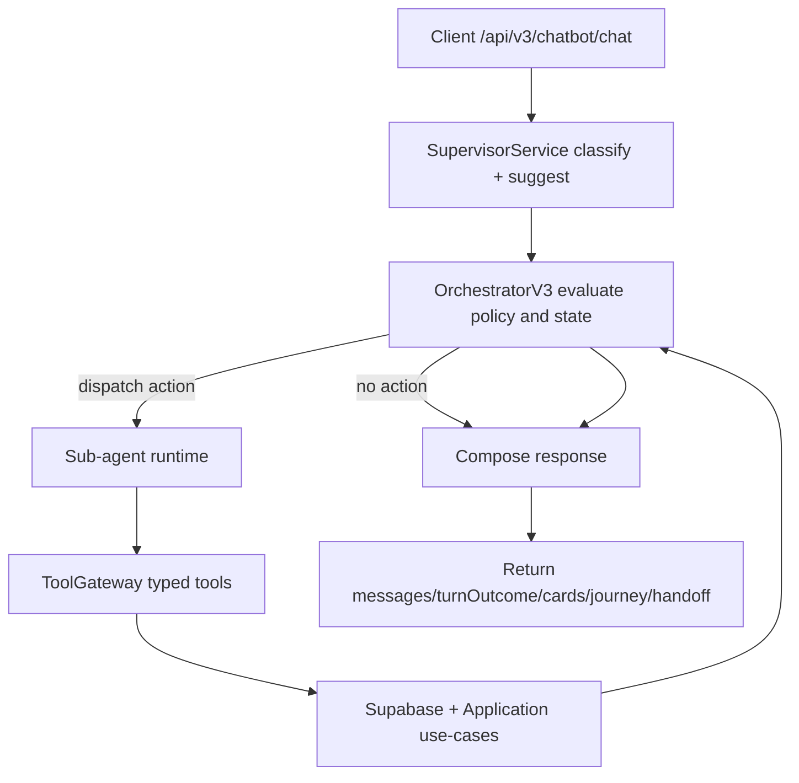

# Chatbot V3 Design: Orchestrator + Supervisor + Multi-Agent (MVP)

Date: 2026-04-15  
Branch: `feature/phase-2bc`  
Status: Approved for planning  
Scope: Medical CRM public chatbot runtime rewrite (no backward compatibility)

## 1) Goal and Scope

Build a new chatbot runtime with these constraints:

- Remove Dify as the primary response engine.
- Do not keep backward compatibility with v2 public contract.
- Frontend can be changed together with backend.
- Use clean architecture: `Supervisor suggests`, `Orchestrator decides`, `Sub-agent executes`.
- Keep implementation minimal and testable.

This spec covers one subsystem only: public chatbot turn runtime and contract.

## 2) Non-Goals

- No v2 compatibility layer.
- No migration shim for old fields (`nextAction`, `secondaryAction`, `blocks`, legacy metadata overlays).
- No standalone QueryAgent process.
- No MCP-first architecture for MVP.
- No redesign of binary upload transport path. `records.upload` only manages chatbot-scoped upload lifecycle metadata and validation in CRM, while file transport remains the existing frontend upload pipeline.

## 3) Final Architecture Decisions

### 3.1 Control ownership

- `SupervisorService`: inference only, returns suggestion.
- `ConversationOrchestratorV3Service`: final authority on stage/phase and dispatch.
- Sub-agents: execute bounded business actions only.

`Orchestrator` is the **only** writer of journey state.

### 3.2 Action dispatch

When a turn requires action, dispatch is performed by `Orchestrator`, not `Supervisor`.

Reason:

- Preserves deterministic control and auditability.
- Keeps jump-step policy enforceable in one place.
- Prevents LLM suggestion from directly mutating business state.

### 3.3 Runtime model

- One request pipeline in API process (Lightsail), no external orchestrator service.
- Typed internal `ToolGateway` for all action calls.
- Supabase remains source of truth for persisted status and business entities.

### 3.4 Public API contract

Use a new endpoint and a minimal response:

- `POST /api/v3/chatbot/chat`
- Response only includes:
  - `messages[]`
  - `turnOutcome`
  - `cards[]`
  - `journey`
  - `handoff`
  - optional `runtimeDebug` in non-production only

## 4) Turn Flow



## 5) Journey State Machine

Stages:

- `EXPLAIN_PROCESS`
- `COLLECT_MEDICAL_INPUTS`
- `RECOMMENDATION`
- `ONLINE_CONSULT`
- `HUMAN_HANDOFF`

Phases:

- `pre`, `active`, `post`

Phase is orchestrator-owned journey metadata. It is not a hard execution contract for sub-agents.

### 5.1 Jump-step policy

Jumping is allowed, but only after orchestrator checks prerequisites from current facts/status.

If prerequisites are missing:

- Do not jump.
- Do not return a special "missing prerequisite card".
- Assistant returns normal text guidance telling user required prior step.
- Journey remains at current stage/phase.

### 5.2 Decision outputs

Orchestrator produces one of:

- `STAY`
- `ADVANCE`
- `SKIP`
- `HANDOFF`

And optionally:

- `dispatchAgent` + `dispatchAction`

### 5.3 Rule source, precedence, and determinism

Rule source is a single config object loaded in API runtime:

- `chatbotV3.orchestrator.jumpRules[]`
- `chatbotV3.orchestrator.globalPolicies`
- `chatbotV3.orchestrator.stagePrerequisites`

`jumpRules[]` minimum schema:

```ts
type JumpRule = {
  id: string;
  priority: number; // higher first
  fromStage: JourneyStage;
  toStage: JourneyStage;
};
```

`globalPolicies` minimum schema:

```ts
type GlobalPolicies = {
  forceExplainProcessBefore: JourneyStage[]; // configurable, not hardcoded
  handoffTriggers: {
    userRequestedHuman: boolean;
    consecutiveCriticalToolFailures: number; // threshold
    safetyPolicyHit: boolean;
  };
};
```

`stagePrerequisites` minimum schema:

```ts
type StagePrerequisites = Partial<
  Record<
    JourneyStage,
    {
      requiresAll?: string[]; // fact keys, e.g. records.saved
      requiresAny?: string[];
      denyIfAny?: string[];
    }
  >
>;
```

M0 default policy bundle (config defaults, not service hardcode):

- `forceExplainProcessBefore = ["RECOMMENDATION", "ONLINE_CONSULT"]`
- `stagePrerequisites.RECOMMENDATION.requiresAll = ["records.saved"]`
- `stagePrerequisites.ONLINE_CONSULT.requiresAll = ["recommendation.picked"]`
- `handoffTriggers.consecutiveCriticalToolFailures = 2`

Precedence (fixed order):

1. Safety/human-handoff hard policy
2. Session authorization and ownership checks
3. `globalPolicies.forceExplainProcessBefore` gate
4. `stagePrerequisites` gate (`requires*` / `denyIfAny`)
5. Highest-priority matching jump rule
6. Default fallback: `STAY`

Determinism guarantee:

- same `journey + status.query snapshot + supervisor suggestion + rule config version`
- same orchestrator output

## 6) Agent Set (MVP)

### 6.1 Supervisor (suggestion only)

Output (internal only):

- `intent`
- `suggestedStage`
- `reason` (internal trace/audit field, not exposed to frontend)

### 6.2 Sub-agents

- `FaqAgent`
  - `faq.search`

- `RecordsAgent`
  - `records.upload`
  - `records.save`
  - `records.status`

- `RecommendationAgent`
  - `recommendation.generate`
  - `recommendation.pick`
  - `recommendation.status`

- `ConsultAgent`
  - `consult.schedule`
  - `consult.status`

- `HandoffAgent`
  - `handoff.create`

### 6.3 Query capability

No standalone QueryAgent.

Use shared read tool:

- `status.query`

Accessible to orchestrator and agents as a read-only aggregator.

### 6.4 Sub-agent runtime interface

All sub-agents implement one runtime shape:

```ts
type AgentActionInput = {
  type: string;
  input: unknown;
  meta: {
    taskPrompt: string; // orchestrator-owned compact task context
  };
};

type AgentActionResult = {
  status: "ok" | "error";
  data?: unknown;
  code?: ToolErrorCode;
  message?: string;
};
```

`taskPrompt` is the only sub-agent context contract in MVP. Conversation history reasoning stays in supervisor/orchestrator; sub-agents remain execution-focused. Sub-agents are not constrained by fixed `pre/active/post` execution rules.

## 7) ToolGateway Contract (Internal)

`ToolGateway` provides typed methods only; agents do not call repositories directly.

```ts
interface ToolGateway {
  faq: {
    search(input: { category?: string; query: string; locale?: string }): Promise<ToolResult<FaqSearchResult>>;
  };
  records: {
    upload(input: UploadInitOrCompleteInput): Promise<ToolResult<UploadResult>>;
    save(input: SaveRecordInput): Promise<ToolResult<SaveRecordResult>>;
    status(input: { sessionId: string }): Promise<ToolResult<RecordStatus>>;
  };
  recommendation: {
    generate(input: { sessionId: string }): Promise<ToolResult<RecommendationGenerateResult>>;
    pick(input: { sessionId: string; hospitalId: string }): Promise<ToolResult<RecommendationPickResult>>;
    status(input: { sessionId: string }): Promise<ToolResult<RecommendationStatus>>;
  };
  consult: {
    schedule(input: ConsultScheduleInput): Promise<ToolResult<ConsultScheduleResult>>;
    status(input: { sessionId: string }): Promise<ToolResult<ConsultStatus>>;
  };
  handoff: {
    create(input: HandoffCreateInput): Promise<ToolResult<HandoffResult>>;
  };
  status: {
    query(input: { sessionId: string }): Promise<ToolResult<UnifiedStatusSnapshot>>;
  };
}
```

Shared gateway policies:

- Mutating calls (`save/generate/pick/schedule/create`) require idempotency key: `sessionId:turnId:toolName`.
- Default timeout:
  - read tools: `3000ms`
  - write tools: `8000ms`
  - external provider dependent writes: `12000ms`
- Tool errors are normalized:

```ts
type ToolErrorCode =
  | "VALIDATION_ERROR"
  | "NOT_FOUND"
  | "CONFLICT"
  | "PERMISSION_DENIED"
  | "TIMEOUT"
  | "UPSTREAM_UNAVAILABLE"
  | "UNKNOWN";
```

- All tool responses are wrapped as:

```ts
type ToolResult<T> =
  | { status: "ok"; data: T }
  | { status: "error"; code: ToolErrorCode; message: string };
```

## 8) Public API Contract (V3)

### 8.1 Request

```json
{
  "sessionId": "string",
  "message": "string (max 2000, allow empty only when attachments present)",
  "attachments": [
    {
      "fileName": "string",
      "fileSize": 12345,
      "mimeType": "application/pdf",
      "storageKey": "string"
    }
  ],
  "pageContext": {
    "type": "HOSPITAL_DETAIL",
    "hospitalId": "string"
  }
}
```

### 8.2 Response

```json
{
  "messages": [
    {
      "role": "assistant",
      "text": "string"
    }
  ],
  "turnOutcome": {
    "status": "ok|degraded",
    "recoverableErrorCode": "TIMEOUT|UPSTREAM_UNAVAILABLE|UNKNOWN|null"
  },
  "cards": [
    {
      "cardId": "string",
      "cardType": "PROCESS_GUIDE|UPLOAD_RECORDS|RECOMMENDATION_LIST|CONSULT_BOOKING|HANDOFF_STATUS",
      "payload": {},
      "actions": [
        {
          "actionType": "OPEN_MODAL|OPEN_URL|SUBMIT|REFRESH_STATUS",
          "label": "string",
          "params": {}
        }
      ]
    }
  ],
  "journey": {
    "stage": "EXPLAIN_PROCESS|COLLECT_MEDICAL_INPUTS|RECOMMENDATION|ONLINE_CONSULT|HUMAN_HANDOFF",
    "phase": "pre|active|post"
  },
  "handoff": {
    "required": false,
    "ticketId": null
  },
  "runtimeDebug": {
    "traceId": "string",
    "idempotencyKey": "string",
    "lastDispatchSource": "orchestrator"
  }
}
```

No additional legacy action fields are returned. `runtimeDebug` is non-production only and is omitted in production responses.

Card schema is discriminated by `cardType`:

```ts
type V3Card =
  | {
      cardType: "PROCESS_GUIDE";
      payload: { guideId: string; title: string };
      actions: Array<{ actionType: "OPEN_MODAL"; label: string; params: { modalKey: "MEDICAL_TRAVEL_PROCESS" } }>;
    }
  | {
      cardType: "UPLOAD_RECORDS";
      payload: { required: boolean; uploadedCount: number };
      actions: Array<{ actionType: "SUBMIT" | "REFRESH_STATUS"; label: string; params: { actionKey: "UPLOAD_RECORDS" } }>;
    }
  | {
      cardType: "RECOMMENDATION_LIST";
      payload: { candidates: Array<{ hospitalId: string; name: string; reason?: string }> };
      actions: Array<{ actionType: "SUBMIT"; label: string; params: { hospitalId: string } }>;
    }
  | {
      cardType: "CONSULT_BOOKING";
      payload: { status: "idle" | "scheduled" | "failed" };
      actions: Array<{ actionType: "SUBMIT" | "REFRESH_STATUS"; label: string; params: { actionKey: "CONSULT_BOOKING" } }>;
    }
  | {
      cardType: "HANDOFF_STATUS";
      payload: { required: boolean; ticketId?: string };
      actions: Array<{ actionType: "OPEN_URL"; label: string; params: { actionKey: "HANDOFF_PORTAL" } }>;
    };
```

### 8.3 Error response contract

Terminal errors use:

```json
{
  "error": {
    "code": "INVALID_REQUEST|UNAUTHORIZED|FORBIDDEN|SERVICE_UNAVAILABLE|INTERNAL_ERROR",
    "message": "string",
    "traceId": "string"
  }
}
```

## 9) Dynamic Rules and Skills

Configurable at runtime (or deploy-time config):

- Supervisor prompt and behavior rules.
- Sub-agent prompts and tool allowlists.
- Jump-step prerequisite rule table.
- Explain-process gate and handoff trigger thresholds in `globalPolicies`.

Not configurable:

- Orchestrator final arbitration mechanism.
- Single-writer state ownership model.

## 10) Observability (M0: Required)

All M0 items are in scope for MVP.

### 10.1 Correlation IDs

Per event/log record:

- `traceId`
- `sessionId`
- `turnId`
- `childRunId` (when sub-agent dispatched)

### 10.2 Required event logs

- `supervisor_suggestion_created`
- `orchestrator_decision_finalized`
- `journey_transition_committed`
- `subagent_dispatched|started|completed|failed|timeout|cancelled`
- `tool_call_started|completed|failed`

Required decision fields:

- `suggestedStage`
- `finalStage`
- `decisionType`
- `matchedRuleId`
- `reason`
- `whyNotSkip` (when jump denied)

### 10.3 Required metrics

- Turn latency: P50/P95/P99
- Success/error rate per endpoint
- Sub-agent failure/timeout/cancel rate
- Tool failure rate by tool name
- Handoff rate
- Jump-denied rate
- Stage distribution and stage dwell time

### 10.4 Required alerts

- `consult.schedule` failure rate > 15% over 5m (min 20 calls)
- `recommendation.generate` failure rate > 20% over 5m (min 20 calls)
- Sub-agent timeout > 10 events over 10m OR timeout ratio > 8%
- Handoff rate > 35% over 30m and > 2x trailing 7-day baseline

### 10.5 Data safety and token control

- Never log raw medical records or full attachment content.
- Tool arguments/results must be redacted before logging.
- `reason` is internal only, max 240 chars after truncation.
- `errorDetail` is redacted and capped to 512 chars.
- Keep message-level verbose traces behind debug flag to avoid token/log explosion.

### 10.6 Runtime observability wiring (minimum required)

- `traceId` generation: route reads `x-request-id` first; if absent, uses `randomUUID()`.
- `traceId` must propagate through route -> runtime -> emitted node events.
- Unified node event envelope (minimum fields):
  - `traceId`, `sessionId`, `turnId`, `node`, `action`, `status`, `latencyMs`, `errorCode?`
- Required node coverage:
  - `Supervisor`, `Orchestrator`, `Subagent`, `Tool`
  - statuses use `started|completed|failed|timeout` as applicable
- Every turn emits one `turn_summary` event with:
  - `decisionAction`, `fromStage`, `toStage`, `outcomeStatus`, `degradedErrorCode?`
- Non-production response may include `runtimeDebug` (`traceId` + runtime debug fields); production must not expose added debug fields.

## 11) Error Handling

### 11.1 Failure matrix

| Failure type | HTTP status | Body | Journey mutation | User-facing behavior |
|---|---:|---|---|---|
| Invalid request schema | 400 | error envelope | none | validation message |
| Session unauthorized / ownership mismatch | 401/403 | error envelope | none | auth message |
| Recoverable tool/sub-agent failure | 200 | normal v3 response | none (`STAY`) | assistant guidance text |
| Sub-agent timeout | 200 | normal v3 response | none (`STAY`) | assistant guidance + status refresh suggestion |
| Upstream unavailable (terminal) | 503 | error envelope | none | temporary unavailable |
| Unexpected internal terminal error | 500 | error envelope | none | generic retry later |

### 11.2 Runtime fallbacks

- If agent/tool action fails: keep response contract valid, no state advance.
- If sub-agent times out: fallback to `status.query` and compose guidance text.
- If orchestrator cannot produce valid decision: force `STAY`.
- If response composition fails after decision: return 500 error envelope with `traceId`.
- For recoverable failures with HTTP 200, set `turnOutcome.status = "degraded"` and fill `turnOutcome.recoverableErrorCode`.

## 12) Deployment and Runtime

- Frontend: Vercel
- API runtime: Lightsail (same API service process)
- Database/state: Supabase

No additional runtime service is required for MVP.

## 13) Testing Requirements (MVP)

Minimum required tests:

1. Orchestrator unit tests
   - stay/advance/skip/handoff decisions
   - jump allow/deny with prerequisite checks
2. ToolGateway unit tests
   - success and failure paths per tool
3. API contract tests
   - response includes only v3 fields
4. Integration tests
   - FAQ path
   - records upload/save path
   - recommendation generate/pick path
   - consult schedule path
   - handoff path
   - jump denied due to missing prerequisite
   - out-of-order repeated submit/pick/schedule with idempotency key
   - overlapping concurrent turns on same `sessionId` (single-writer lock and deterministic state)
   - timeout fallback path (`status.query` is used)
   - malformed attachments/pageContext
   - unauthorized session access

## 14) Interface Appendix

### 14.1 Supervisor and orchestrator contracts

```ts
type SupervisorSuggestion = {
  intent: "faq" | "progression" | "resource" | "consult" | "handoff" | "unknown";
  suggestedStage: JourneyStage;
  reason: string; // internal only
};

type OrchestratorDecision = {
  action: "STAY" | "ADVANCE" | "SKIP" | "HANDOFF";
  from: { stage: JourneyStage; phase: JourneyPhase };
  to: { stage: JourneyStage; phase: JourneyPhase };
  dispatchAgent?: "FaqAgent" | "RecordsAgent" | "RecommendationAgent" | "ConsultAgent" | "HandoffAgent";
  matchedRuleId?: string;
  whyNotSkip?: string;
};
```

## 15) Acceptance Criteria

- Dify is not used in v3 runtime path.
- Journey updates happen only through orchestrator.
- Sub-agent dispatch is triggered only by orchestrator decisions.
- Public response contract contains only v3 fields.
- `records.save` and `consult.schedule` persist to Supabase and are visible in `status.query`.
- Explain-process appearance, stage prerequisites, jump policy, and handoff triggers are driven by orchestrator config (not hardcoded in service logic).
- All M0 observability items are implemented and verified in non-prod.
- End-to-end scenarios pass with no compatibility shim.
