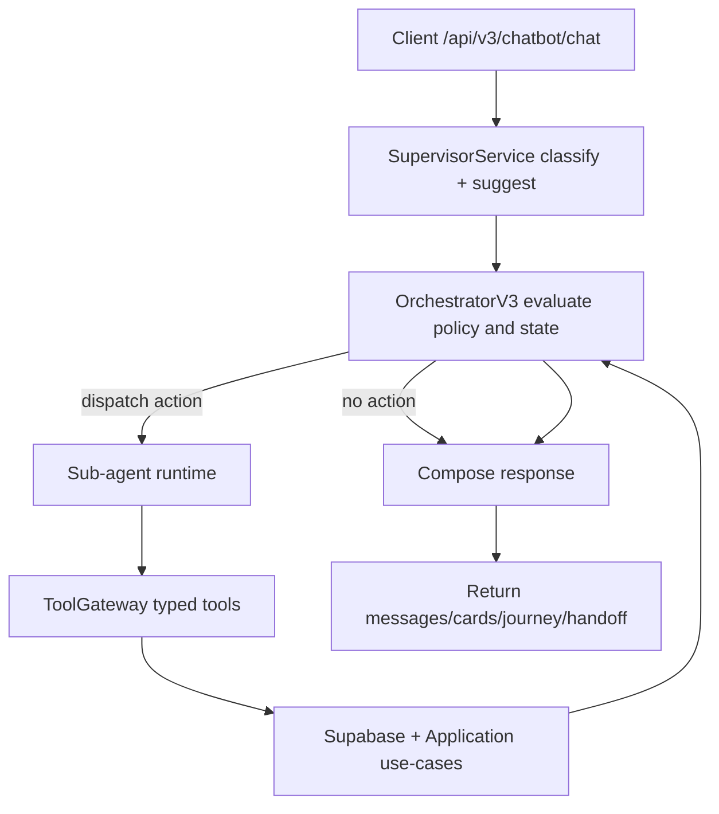

# Chatbot V3 Design: Orchestrator + Supervisor + Multi-Agent (MVP)

Date: 2026-04-15  
Branch: `feature/phase-2bc`  
Status: Approved for planning  
Scope: Medical CRM public chatbot runtime rewrite (no backward compatibility)

## 1) Goal and Scope

Build a new chatbot runtime with these constraints:

- Remove Dify as the primary response engine.
- Do not keep backward compatibility with v2 public contract.
- Frontend can be changed together with backend.
- Use clean architecture: `Supervisor suggests`, `Orchestrator decides`, `Sub-agent executes`.
- Keep implementation minimal and testable.

This spec covers one subsystem only: public chatbot turn runtime and contract.

## 2) Non-Goals

- No v2 compatibility layer.
- No migration shim for old fields (`nextAction`, `secondaryAction`, `blocks`, legacy metadata overlays).
- No standalone QueryAgent process.
- No MCP-first architecture for MVP.
- No redesign of existing upload transport path (frontend upload flow remains; agent consumes upload result/state).

## 3) Final Architecture Decisions

### 3.1 Control ownership

- `SupervisorService`: inference only, returns suggestion.
- `ConversationOrchestratorV3Service`: final authority on stage/phase and dispatch.
- Sub-agents: execute bounded business actions only.

`Orchestrator` is the **only** writer of journey state.

### 3.2 Action dispatch

When a turn requires action, dispatch is performed by `Orchestrator`, not `Supervisor`.

Reason:

- Preserves deterministic control and auditability.
- Keeps jump-step policy enforceable in one place.
- Prevents LLM suggestion from directly mutating business state.

### 3.3 Runtime model

- One request pipeline in API process (Lightsail), no external orchestrator service.
- Typed internal `ToolGateway` for all action calls.
- Supabase remains source of truth for persisted status and business entities.

### 3.4 Public API contract

Use a new endpoint and a minimal response:

- `POST /api/v3/chatbot/chat`
- Response only includes:
  - `messages[]`
  - `cards[]`
  - `journey`
  - `handoff`

## 4) Turn Flow



## 5) Journey State Machine

Stages:

- `EXPLAIN_PROCESS`
- `COLLECT_MEDICAL_INPUTS`
- `RECOMMENDATION`
- `ONLINE_CONSULT`
- `HUMAN_HANDOFF`

Phases:

- `pre`, `active`, `post`

### 5.1 Jump-step policy

Jumping is allowed, but only after orchestrator checks prerequisites from current facts/status.

If prerequisites are missing:

- Do not jump.
- Do not return a special "missing prerequisite card".
- Assistant returns normal text guidance telling user required prior step.
- Journey remains at current stage/phase.

### 5.2 Decision outputs

Orchestrator produces one of:

- `STAY`
- `ADVANCE`
- `SKIP`
- `HANDOFF`

And optionally:

- `dispatchAgent` + `dispatchAction`

## 6) Agent Set (MVP)

### 6.1 Supervisor (suggestion only)

Output (internal only):

- `intent`
- `suggestedStage`
- `reason` (internal trace/audit field, not exposed to frontend)

### 6.2 Sub-agents

- `FaqAgent`
  - `faq.search`

- `RecordsAgent`
  - `records.upload`
  - `records.save`
  - `records.status`

- `RecommendationAgent`
  - `recommendation.generate`
  - `recommendation.pick`
  - `recommendation.status`

- `ConsultAgent`
  - `consult.schedule`
  - `consult.status`

- `HandoffAgent`
  - `handoff.create`

### 6.3 Query capability

No standalone QueryAgent.

Use shared read tool:

- `status.query`

Accessible to orchestrator and agents as a read-only aggregator.

## 7) ToolGateway Contract (Internal)

`ToolGateway` provides typed methods only; agents do not call repositories directly.

```ts
interface ToolGateway {
  faq: {
    search(input: { category?: string; query: string; locale?: string }): Promise<FaqSearchResult>;
  };
  records: {
    upload(input: UploadInitOrCompleteInput): Promise<UploadResult>;
    save(input: SaveRecordInput): Promise<SaveRecordResult>;
    status(input: { sessionId: string }): Promise<RecordStatus>;
  };
  recommendation: {
    generate(input: { sessionId: string }): Promise<RecommendationGenerateResult>;
    pick(input: { sessionId: string; hospitalId: string }): Promise<RecommendationPickResult>;
    status(input: { sessionId: string }): Promise<RecommendationStatus>;
  };
  consult: {
    schedule(input: ConsultScheduleInput): Promise<ConsultScheduleResult>;
    status(input: { sessionId: string }): Promise<ConsultStatus>;
  };
  handoff: {
    create(input: HandoffCreateInput): Promise<HandoffResult>;
  };
  status: {
    query(input: { sessionId: string }): Promise<UnifiedStatusSnapshot>;
  };
}
```

## 8) Public API Contract (V3)

### 8.1 Request

```json
{
  "sessionId": "string",
  "message": "string",
  "attachments": [],
  "pageContext": {}
}
```

### 8.2 Response

```json
{
  "messages": [
    { "role": "assistant", "text": "string" }
  ],
  "cards": [
    { "cardType": "string", "payload": {}, "actions": [] }
  ],
  "journey": {
    "stage": "EXPLAIN_PROCESS|COLLECT_MEDICAL_INPUTS|RECOMMENDATION|ONLINE_CONSULT|HUMAN_HANDOFF",
    "phase": "pre|active|post"
  },
  "handoff": {
    "required": false,
    "ticketId": null
  }
}
```

No additional legacy action fields are returned.

## 9) Dynamic Rules and Skills

Configurable at runtime (or deploy-time config):

- Supervisor prompt and behavior rules.
- Sub-agent prompts and tool allowlists.
- Jump-step prerequisite rule table.

Not configurable:

- Orchestrator final arbitration mechanism.
- Single-writer state ownership model.

## 10) Observability (M0: Required)

All M0 items are in scope for MVP.

### 10.1 Correlation IDs

Per event/log record:

- `traceId`
- `sessionId`
- `turnId`
- `childRunId` (when sub-agent dispatched)

### 10.2 Required event logs

- `supervisor_suggestion_created`
- `orchestrator_decision_finalized`
- `journey_transition_committed`
- `subagent_dispatched|started|completed|failed|timeout|cancelled`
- `tool_call_started|completed|failed`

Required decision fields:

- `suggestedStage`
- `finalStage`
- `decisionType`
- `matchedRuleId`
- `reason`
- `whyNotSkip` (when jump denied)

### 10.3 Required metrics

- Turn latency: P50/P95/P99
- Success/error rate per endpoint
- Sub-agent failure/timeout/cancel rate
- Tool failure rate by tool name
- Handoff rate
- Jump-denied rate
- Stage distribution and stage dwell time

### 10.4 Required alerts

- `consult.schedule` failure rate above threshold
- `recommendation.generate` failure rate above threshold
- Sub-agent timeout spike
- Handoff rate sudden spike

### 10.5 Data safety and token control

- Never log raw medical records or full attachment content.
- Tool arguments/results must be redacted before logging.
- `reason` is short-form text, capped length, internal only.
- Keep message-level verbose traces behind debug flag to avoid token/log explosion.

## 11) Error Handling

- If agent or tool action fails:
  - Do not advance journey state.
  - Return normal assistant guidance text.
  - Keep response contract valid.

- If sub-agent times out:
  - Fallback to `status.query` + assistant guidance.
  - Record timeout event and metric.

- If orchestrator cannot produce valid decision:
  - Safe fallback: `STAY` + assistant guidance.

## 12) Deployment and Runtime

- Frontend: Vercel
- API runtime: Lightsail (same API service process)
- Database/state: Supabase

No additional runtime service is required for MVP.

## 13) Testing Requirements (MVP)

Minimum required tests:

1. Orchestrator unit tests
   - stay/advance/skip/handoff decisions
   - jump allow/deny with prerequisite checks
2. ToolGateway unit tests
   - success and failure paths per tool
3. API contract tests
   - response includes only v3 fields
4. Integration tests
   - FAQ path
   - records upload/save path
   - recommendation generate/pick path
   - consult schedule path
   - handoff path

## 14) Acceptance Criteria

- Dify is not used in v3 runtime path.
- Journey updates happen only through orchestrator.
- Sub-agent dispatch is triggered only by orchestrator decisions.
- Public response contract contains only v3 fields.
- All M0 observability items are implemented and verified in non-prod.
- End-to-end scenarios pass with no compatibility shim.

