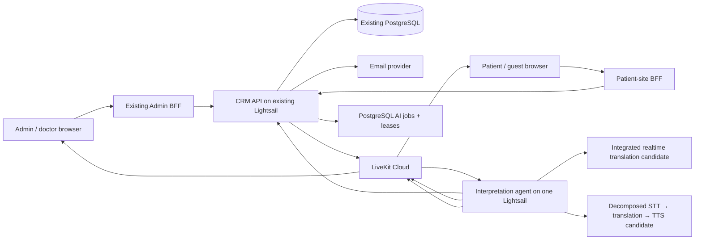

# Low-Cost Multiparty Video Consultations with AI Captions and Translated Speech

**Date:** 2026-08-29

**Status:** Proposed low-cost production design; provider and clinical quality gates remain blocking

**Primary system:** `medical-crm-v2`

**Related patient frontend:** `medicaltourismchina-platform`
**Replaces:** Nothing. This is a cost-reduced launch profile alongside the enterprise target design dated 2026-08-28.

## 1. Executive decision

Launch secure multiparty video, AI captions, and translated speech without provisioning the enterprise design's ECS/Fargate, ECR, SQS, NAT Gateway, Multi-AZ ElastiCache, IAM Roles Anywhere, or private SigV4 proxy.

The low-cost production topology is:

1. Keep the CRM API, PostgreSQL-backed orchestration, and five lightweight batch loops on the existing API Lightsail instance.
2. Add one 4 GB Lightsail instance for the LiveKit interpretation agent. Add a second identical instance only when load tests, concurrency, or availability requirements justify it.
3. Keep LiveKit Cloud as the media SFU and TURN service.
4. Call a streaming speech provider from the interpretation Lightsail. The first integrated candidate to evaluate is OpenAI `gpt-realtime-translate`, because one stream returns translated audio and transcript deltas at a published `$0.034` per audio minute. Its current public model page does not promise a separate source-language transcript, so it is not the complete launch default unless an exact endpoint capability test proves that requirement. Compare it against the lower-component-cost Cloudflare STT → translation → TTS pipeline before launch.
5. Keep AI output explicitly assistive. The original audio remains available, every participant sees an AI warning, and a human interpreter remains the escalation path for clinically consequential decisions.

This profile targets an initial maximum of eight human participants, Chinese ↔ English, up to two concurrent AI-enabled rooms per interpretation host, and no recording or durable transcript by default. Those are launch limits, not untested capacity claims.

## 2. Why this profile exists

The enterprise target design optimizes for autoscaling, multi-AZ state, highly isolated workload identity, and extensively fenced recovery. Those controls are valuable at larger scale, but they introduce a substantial fixed-cost and operational baseline before the first AI-enabled consultation.

This profile accepts the following bounded trade-offs:

- one interpretation host is a temporary single point of failure for AI, but never for the human call;
- failover is lease-based and takes tens of seconds rather than being seamless;
- deployments and scaling are host-oriented rather than container-orchestrated;
- secrets are delivered as root-owned host files and rotated operationally instead of through a full cloud workload-identity chain;
- PostgreSQL is the job queue and source of truth at launch scale;
- no Multi-AZ cache is required because no credential or authorization decision depends on cache survival.

It does not relax room authorization, invitation scope, LiveKit grant restrictions, consent, auditability, or the requirement that AI failure cannot disconnect humans.

## 3. Launch assumptions and limits

| Dimension | Launch value |
|---|---|
| Human participants | Maximum 8 per room |
| Service participants | Maximum 1 interpretation agent per active room generation |
| Languages | Chinese (`zh`) ↔ English (`en`) |
| Concurrent AI rooms per 4 GB interpretation host | Start at 2; raise only after measured load tests |
| Video provider | LiveKit Cloud |
| AI features | Source captions, translated captions, translated speech |
| Recording | Off |
| Durable transcript | Off by default |
| Caption replay | Final captions only, in memory for up to 2 minutes |
| Human interpretation | Required escalation path for high-risk clinical communication |

If launch needs more languages, more than two simultaneous AI rooms, 24/7 AI high availability, or regulated-data terms that the chosen self-service vendors cannot provide, this profile must be revised before enablement.

## 4. Architecture



### 4.1 Resource count

Required incremental infrastructure for launch:

| Resource | Count | Purpose |
|---|---:|---|
| Existing API Lightsail | 0 new | API, invitation/email/action/cleanup loops, PostgreSQL job coordination |
| 4 GB interpretation Lightsail | 1 new | LiveKit agent, audio routing, provider WebSockets, TTS publication |
| Second 4 GB interpretation Lightsail | 0 initially; 1 optional | Additional capacity or warm standby after testing |
| Cloudflare Workers Paid account | 0 for OpenAI path; 1 for Cloudflare AI production path | Workers AI production usage will normally require the paid plan; it is not an execution host for the agent |
| LiveKit Cloud project | Existing or 1 per environment | SFU, TURN, webhooks, room server APIs |

No launch requirement exists for ECS, Fargate, ECR, SQS, NAT Gateway, ElastiCache, Cloudflare Durable Objects, Cloudflare Queues, or Cloudflare Containers.

The optional staff-only `CLIENT_DIRECT_EXPERIMENT` uses zero additional Lightsail instances, but it is not the recommended multiparty production profile. `SERVER_AGENT` requires one additional interpretation host.

Staging can share the interpretation host only while it has a separate process user, configuration, LiveKit project, database namespace, and strict capacity reservation. Before public clinical rollout, production should have a dedicated interpretation host.

## 5. Cloudflare decision

### 5.1 Do not run the LiveKit agent in a Cloudflare Worker

Cloudflare Workers support WebSockets and do not charge for wall-clock duration, but the standard runtime has a 128 MB memory limit, CPU limits, rolling runtime updates, and no conventional always-on process model. Queue consumers are limited to 15 minutes of wall time. A LiveKit interpretation agent is a long-lived WebRTC media participant with audio SDK, codec, track, reconnection, and process-supervision needs.

Therefore:

- do not deploy the LiveKit Agent SDK inside a Worker;
- do not proxy LiveKit audio through a Worker merely to reach Workers AI;
- do not use Durable Objects as the authoritative meeting database;
- do not introduce Cloudflare Queues while PostgreSQL leases meet measured launch load.

Cloudflare Containers could eventually host a conventional agent process, but they add a newer runtime, separate deployment model, network validation, and usage-based compute. Reconsider them only after a staging proof demonstrates LiveKit connectivity, codec/runtime compatibility, predictable sleep behavior, graceful draining, and a lower measured monthly cost than Lightsail.

### 5.2 Where Cloudflare can reduce AI cost

The Lightsail agent may call Workers AI directly from server-side code:

- streaming STT candidate: `@cf/deepgram/nova-3` over WebSocket;
- batch fallback STT: `@cf/openai/whisper-large-v3-turbo`, not for low-latency primary captions;
- translation candidate: `@cf/meta/m2m100-1.2b`, subject to medical bilingual evaluation;
- TTS candidate: `@cf/myshell-ai/melotts`, only for language tags and voices proven by an executable Chinese/English capability test;
- English-only quality candidate: Deepgram Aura; it cannot be the sole Chinese ↔ English launch adapter.

The adapter interface must allow Cloudflare, OpenAI, xAI, or another provider to be swapped without changing meeting authorization or LiveKit grants.

Workers AI is inexpensive enough to evaluate, but price is not approval. Before real patient audio is sent, confirm contractual terms, processing locations, retention/logging, subprocessors, deletion behavior, and whether the required healthcare/privacy agreement covers each selected model. Cloudflare states that a HIPAA BAA is limited to Enterprise customers; self-service Workers AI must not be assumed to cover PHI.

### 5.3 Client-direct OpenAI WebRTC: valid experiment, not the default multiparty architecture

OpenAI officially supports browser-to-Realtime WebRTC using a short-lived client secret minted by a developer-controlled server. This can remove the interpretation host from a standalone one-user translator or tightly controlled internal pilot:

```text
browser / desktop app
  -> authenticated CRM API requests a short-lived OpenAI client secret
  -> browser connects directly to OpenAI over WebRTC
  -> microphone audio and translated audio do not traverse the CRM API
```

This is a real cost and latency optimization. The existing CRM API should mint the client secret because it already owns meeting authorization; adding a Cloudflare Worker solely as a second auth broker would duplicate trust and add no savings.

For the multiparty medical meeting, however, direct playback returns translated audio to the same browser that supplied the microphone. Delivering that result to everybody else requires the source browser to capture the OpenAI output and republish a second track into LiveKit. That creates material constraints:

- translation stops when that participant's tab sleeps, browser crashes, device changes, or mobile OS throttles it;
- a compromised participant browser can forge captions or republish arbitrary audio as if it were AI output;
- every patient, guest, doctor, and mobile browser must implement and pass the dual-WebRTC/audio-routing path;
- server-side consent withdrawal and generation fencing cannot instantly control an already issued browser session unless the provider lifecycle is explicitly controllable;
- room-wide caption replay, consistent speaker attribution, spend enforcement, and support diagnostics become fragmented across clients;
- autoplay, echo cancellation, audio capture, and feedback behavior vary by browser.

Therefore this design permits client-direct mode only as an explicit `CLIENT_DIRECT_EXPERIMENT` for staff-only or one-to-one evaluation. Production multiparty mode remains `SERVER_AGENT`, using one interpretation Lightsail so that AI identity, routing, consent, and output publication stay centrally controlled. Promotion of client-direct mode requires a separate threat model and the complete browser/device test matrix; it is not an automatic way to claim zero servers.

In either mode, never ship a standard OpenAI API key to the browser. Only a short-lived provider client secret may leave the backend. The application issuance record is bound to consultation, member, model, language, and auth version; provider session configuration is locked to the narrowest supported values. Issuance must be authorized, rate-limited, metered, and audited.

### 5.4 OpenAI provider candidates and turn detection

Official current candidates include:

- `gpt-realtime-translate`: dedicated streaming speech-to-speech translation, translated audio plus transcript deltas, published at `$0.034` per audio minute;
- `gpt-realtime-2.1-mini`: lower-cost general Realtime voice/reasoning model with WebRTC, WebSocket, SIP, audio input/output, and function calling; evaluate it only when prompt-controlled business phrasing adds value over faithful translation;
- `gpt-realtime-2.1`: higher-cost comparator for cases where the mini model fails the agreed quality threshold.

General OpenAI Realtime sessions document server VAD, semantic VAD, and `speech_started`, but those capabilities must not be inferred for the dedicated `/v1/realtime/translations` endpoint. Enable provider-side turn detection or cancellation only after an executable test of the exact model, endpoint, and transport proves the accepted configuration, event names/order, barge-in behavior, cancellation behavior, and whether cancellation stops billing.

For `gpt-realtime-translate`, default to lightweight local PCM energy/VAD in the interpretation agent for playout discard, ducking, and lag handling. Treat a 600–800 ms cancellable playout debounce only as a starting measurement, not a provider guarantee. If the provider cannot cancel output, discard or mute it locally and close the source session when necessary. Do not copy unverified fixed low/medium/high timeout numbers into product behavior.

The debounce is a latency/turn-taking policy, not an authorization control. In `SERVER_AGENT` mode it runs in the interpretation agent; in `CLIENT_DIRECT_EXPERIMENT` it may run locally.

## 6. AI media pipeline

### 6.1 Track authority

The agent joins LiveKit with `autoSubscribe=false`. It subscribes explicitly only after the CRM API freshly confirms the current room generation, interpretation generation, admitted member, exact microphone track SID, and current consent. It subscribes only to current-generation human microphone tracks registered by verified LiveKit webhooks or a server-side room listing. It must reject:

- its own published tracks;
- other service-participant tracks;
- camera or screen-share audio unless explicitly supported later;
- stale room generations;
- tracks whose member is not currently admitted;
- tracks belonging to a participant who has not consented to AI processing.

Browser-supplied room names, roles, participant identities, track SIDs, and target destinations are never authoritative.

An authenticated member or host may request a launch-language preference through the CRM API, but cannot assert it through browser/LiveKit metadata. The API verifies consultation membership, consent, current generations, and the `zh`/`en` allowlist, then stores `expected_source_language`, the deterministic opposite `target_language`, `language_version`, `set_by_principal_id`, and `set_at` on the authoritative source-track/member configuration. Provider-session creation binds that language version. A requested change may be recorded as pending, but the API first stops the old session and clears its queues. It creates the replacement only after confirmed provider closure, conservative provider expiry, or an executable-tested transfer/resume, then activates the new language version. Changing target or version cannot bypass the active-session fence.

Automatic direction switching is off at launch. Unknown or materially mismatched language suppresses translated speech and asks the user or host to confirm the language while original audio continues. A provider language-confidence signal may flag mismatch but cannot authorize a direction change. Brief code-switching remains best effort in the configured direction; sustained switching requires an explicit language update and session restart.

On consent withdrawal, STOP, member removal, track unpublish, lease loss, or generation change, the agent must unsubscribe immediately and within the two-second product bound: stop forwarding frames, flush PCM/VAD/provider-input buffers, cancel or close that source's provider session where supported, purge interim/final replay, discard queued TTS, unpublish affected translated output, and emit an audit event.

This remains a lower-cost trust compromise: LiveKit grants `canSubscribe` at room scope, not as an application-enforced per-track consent policy. A compromised interpretation host holding a valid room token could bypass the agent's filtering. Mitigations are one short-lived agent identity/token per room generation, `autoSubscribe=false`, minimal provider keys, token removal on lease loss/STOP, host isolation, and audit/reconciliation. Workloads requiring infrastructure-enforced per-track isolation must use the enterprise profile or a separately reviewed room topology.

### 6.2 Per-speaker processing

Each source microphone track has an independent provider session. Exactly one provider profile is active for a job; launch does not run both profiles simultaneously.

`INTEGRATED_REALTIME` is:

```text
LiveKit source track
  -> PCM resample / optional local VAD
  -> integrated realtime translation session
  -> translated audio + provider-documented transcript deltas
  -> validated translated captions and target-language LiveKit audio publication
```

The exact translation endpoint must prove whether transcript deltas represent source text, translated text, or both, including interim/final, segment mapping, and reconnect semantics. Current public documentation does not promise a separate source-language transcript. If the approved product requires source and translated captions, `INTEGRATED_REALTIME` does not qualify by itself unless that capability is proved and contractually stable; otherwise select `DECOMPOSED`. Do not silently add a parallel STT stream, because that would create a hybrid profile with duplicate audio upload and additional billing requiring separate review.

`DECOMPOSED` is:

```text
LiveKit source track
  -> PCM resample / VAD
  -> streaming STT
  -> source interim caption
  -> final source segment
  -> text translation
  -> translated final caption
  -> TTS chunk
  -> target-language LiveKit audio publication
```

With `INTEGRATED_REALTIME`, suppressing or unpublishing translated audio is a local UX/capacity action; it does not prove the provider stopped generating or billing audio. An integrated provider failure may remove both translated captions and speech for that source. With `DECOMPOSED`, TTS can fail or be disabled while source/translated captions continue. Do not claim component-level provider isolation for the integrated profile.

Caption segments carry server-derived:

- consultation ID;
- room generation;
- interpretation generation;
- source member ID and display label;
- source track SID;
- source and target language;
- language version and current lease version;
- monotonic segment sequence;
- source start/end time;
- final/interim state.

The provider cannot choose consultation, member, destination, language authority, or LiveKit identity fields.

### 6.3 Caption delivery

The agent publishes captions through a dedicated LiveKit data topic. Clients accept caption messages only from the API-designated exact current interpretation-agent identity and validate the current room/interpretation generation, language version, lease version, and schema version.

Interim captions are best effort and never stored. Final captions may be retained in the agent's memory for at most two minutes and replayed only to a newly reconnected, currently authorized participant. No transcript is written to PostgreSQL unless a later product and retention decision explicitly enables it.

### 6.4 Translated speech delivery

For Chinese ↔ English launch:

- Chinese source speech produces English translated captions and an English audio track;
- English source speech produces Chinese translated captions and a Chinese audio track;
- listeners choose original only, translated only, or original with translated-audio ducking;
- the original audio is always recoverable with one control;
- translated audio is visibly labeled as AI-generated;
- the agent never subscribes to its own translated tracks, preventing feedback loops.

Common behavior caps translated-speech lag at five seconds and never plays stale output.

With `INTEGRATED_REALTIME`, the agent publishes provider-translated audio directly; there is no application TTS queue. On excessive lag it discards or stops publishing stale audio and closes the source session if it cannot recover. It may keep captions active only if the exact endpoint has proved that transcript delivery survives audio suppression or cancellation.

With `DECOMPOSED`, TTS begins only from final or explicitly stable partial translation segments. The agent serializes speech per target language, drops superseded queued partials, and pauses translated audio while keeping captions active when lag exceeds the cutoff.

### 6.5 Medical safety behavior

- UI text states that captions and speech are AI-generated and may be wrong.
- Numbers, medication names, allergies, negation, laterality, dates, and doses receive glossary/high-risk term highlighting where supported.
- Participants can reveal the source caption beside its translation only for a provider profile qualified to supply both; the complete launch feature set requires this capability.
- A host can stop AI without ending the human room.
- `INTEGRATED_REALTIME` failure may remove translated captions and speech together. `DECOMPOSED` degrades speech first, then translated captions, then source captions. The base call remains connected in both profiles.
- The application does not use translations for diagnosis, orders, consent, or clinical record automation without human confirmation.

## 7. PostgreSQL orchestration instead of SQS

PostgreSQL remains the source of truth and launch-scale queue.

### 7.1 Minimal tables

Add or retain these bounded records:

1. `video_consultation_interpretation_jobs`
   - one row per consultation/room/interpretation generation;
   - desired state, status, language pair, consent policy version;
   - assigned worker ID, lease version, lease expiry, heartbeat;
   - failure code, started/stopped timestamps;
   - provider profile, maximum AI duration, reserved/estimated-consumed micro-dollars, soft/hard budget state;
   - unique active job per consultation generation.
2. `video_consultation_interpretation_events`
   - append-only START, CLAIM, HEARTBEAT_LOST, TAKEOVER, STOP, FAIL, COMPLETE events;
   - no raw audio, transcript, provider secret, or LiveKit token.
3. `video_consultation_source_tracks`
   - current human microphone authority derived from LiveKit state;
   - expected source language, target language, language version, setter and set timestamp;
   - published/unpublished timestamps and current generation.
4. `video_consultation_ai_consents`
   - participant, policy version, granted/declined/revoked state and audit attribution.
5. `video_consultation_provider_sessions`
   - one row per job and source track provider session;
   - provider/profile, opaque provider session/reference ID when supplied, job and source-track IDs;
   - room/interpretation generation, source/target language, language version, assigned worker ID, and lease version;
   - state, created/last-seen/application-deadline/provider-expiry/closed timestamps;
   - close capability/result, orphan-risk state, and non-content metering counters;
   - a PostgreSQL partial unique constraint permits at most one `CREATING`, `ACTIVE`, `CLOSING`, or `ORPHAN_WAIT` row per job, source track, and interpretation generation; language fields are deliberately excluded so a direction change cannot bypass the billing fence;
   - never provider secrets, raw audio, captions, transcripts, or reusable credentials.
6. `video_consultation_interpretation_hosts`
   - random installation ID, bearer-secret SHA-256 digest, enabled/revoked status;
   - maximum jobs, created/rotated/revoked timestamps and operator attribution;
   - never the raw host bearer secret.

Do not add a separate capacity subsystem until one of these becomes true:

- more than two concurrent rooms per host;
- multiple simultaneous providers per source track;
- automatic cross-host takeover is enabled;
- measured scheduling contention shows that the job and provider-session constraints are insufficient.

### 7.2 Claim and lease protocol

- Each interpretation host receives one random 256-bit bearer secret. The raw secret exists only in its root-owned `/etc/medora/` secret file; the API stores only a SHA-256 digest on a host record containing `worker_installation_id`, status, created/rotated/revoked timestamps, and optional operator attribution.
- TLS is mandatory. The bearer authenticates claim, heartbeat, agent-token, STOP acknowledgment, complete, and fail endpoints. Rotation accepts an explicitly bounded overlap; revocation immediately blocks new calls and forces owned leases toward STOP/recovery.
- The API-side claim service uses `SELECT ... FOR UPDATE SKIP LOCKED` at a bounded interval and exposes only the authenticated claim contract.
- Claim increments `lease_version`, binds the job to the authenticated `worker_installation_id`, and sets a 30-second lease.
- Agent claims and heartbeats every 10 seconds only through CRM API endpoints. The interpretation host has no PostgreSQL credential or network route.
- Every post-claim call must match job ID, room generation, interpretation generation, assigned worker installation ID, and current lease version; the database mutation repeats those fields in its conditional update.
- The API mints an agent LiveKit token only for the exact authenticated host holding the current unexpired lease.
- Every state mutation includes job ID, room generation, interpretation generation, and lease version.
- A worker stops provider-bound audio immediately when it cannot renew two consecutive heartbeats.
- API reconciliation may make an expired job claimable after the old agent has been removed from LiveKit or confirmed absent.
- Takeover cannot create a replacement provider session merely because the old lease expired. Reconciliation first expires the lease, removes the old LiveKit participant, and requests provider closure. A replacement becomes eligible only after confirmed closure, conservative `provider_expiry` for an uncloseable `ORPHAN_WAIT` session, or a provider-documented and executable-tested transfer/resume. Database state must never claim `CLOSED` without evidence. The old budget reservation remains held through orphan expiry.
- Every agent LiveKit identity/token, caption payload, and translated-track metadata includes `lease_version`. Clients accept output only from the API-designated exact identity and current lease version; late output from an old fence fails the same check. The partial unique provider-session constraint is the billing fence, while LiveKit removal and lease-version validation are the playback fence.
- `STOP` is monotonic for a generation. No late heartbeat can turn it back into `RUNNING`.

With one host, failover means process restart. With two hosts, the standby claims only after lease expiry, old-agent removal, and the provider-session closure/expiry/transfer fence above. Duplicate translated audio or billing is less acceptable than a short AI interruption.

## 8. API and invitation security

The low-cost profile retains the important controls from the enterprise design:

- meeting invitations are random, consultation-scoped, single-use, expiring, revocable, and stored only as digests;
- invitation redemption creates a database-backed browser session and consultation binding;
- a five-minute redemption recovery window may retry only with the same purpose-bound browser bootstrap nonce digest, preventing a lost HTTP response from permanently consuming the invitation;
- Admin and doctor admission derives from authenticated CRM principal and consultation membership, not from an external invitation;
- LiveKit credentials are minted by `apps/api`, last no more than 15 minutes for initial connection, and derive room, stable identity, grants, and role from database state;
- all human tokens explicitly deny room-admin and metadata-update privileges;
- moderation, removal, room close, and token revocation are server-side LiveKit operations and audit events;
- join, leave, reconnect, invitation, consent, AI start/stop, agent claim, and provider failures are auditable;
- the browser never receives LiveKit API secret, provider key, Cloudflare API token, or email-provider secret.

The exact two-minute Valkey credential-escrow protocol from the enterprise design is not used. Recovery is based on a narrowly scoped database redemption state and a browser-held bootstrap secret whose digest is stored. No authorization depends on a cache, so Redis/Valkey is not a launch dependency.

## 9. Host deployment

### 9.1 Existing API Lightsail

Run these as separate least-privilege systemd units or timers on the existing host:

- `medora-crm-v2-api`;
- `medora-video-email-worker`;
- `medora-video-actions-worker`;
- `medora-video-reconcile-worker`;
- `medora-video-cleanup-worker`;
- `medora-video-ai-dispatch-worker`.

They are processes, not separate servers. Each unit has restart limits, a health timestamp, structured redacted logs, and a dedicated database role where practical.

### 9.2 Interpretation Lightsail

Recommended starting bundle: Linux 4 GB RAM, 2 vCPU. Run:

- one `medora-video-interpretation` supervisor;
- one isolated child process/task per active room;
- maximum two active rooms until load tests approve more;
- systemd `Restart=on-failure` with bounded backoff;
- automatic security updates in a maintenance window;
- host firewall allowing only SSH through an operator allowlist and required outbound traffic;
- no public application listener unless a health endpoint is protected by the API host or monitoring allowlist.

The host does not hold the LiveKit server API secret. It requests a short-lived, generation-bound agent participant token from `apps/api` after a valid job claim.

### 9.3 Secrets

For the low-cost host profile:

- store secrets outside the repository in root-owned files under `/etc/medora/` with mode `0600`, and expose them to the non-root systemd service through `LoadCredential=` or an equivalently scoped runtime credential file;
- give the service only its per-host CRM bearer and the provider keys it needs;
- keep API signing, invitation HMAC, and LiveKit server secrets off the interpretation host;
- never place secrets in command-line arguments, logs, systemd unit text committed to git, or health responses;
- document 90-day rotation and immediate incident rotation;
- prohibit whole-instance Lightsail snapshots after any live secret has been provisioned, because individual `/etc` files cannot be excluded from an instance snapshot;
- treat the interpretation host as disposable: rebuild it from pinned automation and inject secrets separately from an offline encrypted recovery copy with access logging;
- use only a separately built secret-free base image if an image is needed for faster recovery; never promote a running secret-bearing instance into that image.

This is operationally simpler but weaker than workload identity. Upgrade to a managed secret/workload-identity design before autoscaling to untrusted or ephemeral compute.

## 10. Capacity and backpressure

Launch limits are enforced by the API, not just by host convention:

- maximum 2 active AI jobs on one 4 GB interpretation host;
- maximum 8 humans in one room;
- maximum 8 subscribed human microphone tracks;
- maximum one target-language speech queue per supported target language;
- maximum caption text length and TTS queue depth;
- provider per-minute, per-room, daily, and monthly budget caps;
- tenant-level concurrent AI room cap;
- reject new AI START with `AI_CAPACITY_UNAVAILABLE` while keeping video available.

Before START, PostgreSQL atomically reserves a conservative worst-case amount using the approved provider rate, maximum AI duration, and currently consented source-stream count. Subscribing another source track requires an incremental reservation before the explicit LiveKit subscribe. The job stores reserved and locally estimated consumed micro-dollars without caption or transcript content.

Budget enforcement runs at least every five seconds from local provider-audio/wall-clock counters rather than waiting for delayed vendor invoices:

- a soft threshold warns operators/users and rejects new AI START or new source-stream reservations;
- for `DECOMPOSED`, soft shedding first stops TTS, then reduces interim-caption frequency;
- for `INTEGRATED_REALTIME`, locally muting audio may protect UX/CPU but does not count as cost shedding;
- a hard per-room or tenant threshold closes every billed provider session for the affected job, prevents restart in that interpretation generation, and marks AI `BUDGET_EXHAUSTED` while the human call continues;
- bounded overrun is limited to one five-second enforcement interval multiplied by active source streams and the configured provider rate, plus documented provider billing granularity. Keep an additional safety margin in the reservation.

Operational load shedding, separate from a hard cost cap, is profile-specific:

1. `DECOMPOSED`: stop TTS and retain captions;
2. `INTEGRATED_REALTIME`: unpublish translated audio if local media capacity is constrained, while acknowledging the provider session may continue billing until closed;
3. reduce interim caption publication frequency;
4. admit no new AI rooms or source tracks;
5. at the hard resource/cost boundary, close provider sessions and stop AI;
6. never shed or disconnect human LiveKit media.

CPU, memory, event-loop lag, provider RTT, caption latency, speech lag, active tracks, and restart count are measured. Raise concurrency only after a 90-minute soak at target participants keeps memory below 70%, sustained CPU below 65%, no audio gaps caused by the agent, and translated-caption p95 latency within the approved product target.

## 11. Cost model

All figures are estimates in USD and must be rechecked before purchase.

### 11.1 Fixed monthly infrastructure

| Item | One-host OpenAI path | One-host Cloudflare AI path | Two-host Cloudflare AI path |
|---|---:|---:|---:|
| New 4 GB Lightsail interpretation host | ~$24 | ~$24 | ~$48 |
| Cloudflare Workers Paid minimum | $0 | ~$5 | ~$5 |
| Logs/rebuild artifacts | usage-based | usage-based | usage-based |
| Existing API/database/Vercel | unchanged | unchanged | unchanged |
| Incremental fixed subtotal | **~$24/month** | **~$29/month** | **~$53/month** |

LiveKit Cloud and AI inference are usage-based and excluded from the fixed subtotal. A LiveKit agent counts as a connected participant, so both connection minutes and outbound media must be included in the LiveKit estimate.

### 11.2 Cloudflare AI reference rates as of 2026-08-29

Current published examples include:

- Nova-3 streaming STT: `$0.0092` per WebSocket audio minute;
- Whisper Large v3 Turbo batch STT: about `$0.0005` per audio minute;
- M2M100 translation: about `$0.342` per million input tokens and the same per million output tokens;
- MeloTTS: about `$0.0002` per generated audio minute;
- Workers Paid platform minimum: `$5/month`, with a daily Workers AI free allocation before usage charges.

Do not budget MeloTTS until Chinese and English voice quality, language parameters, latency, and clinical comprehensibility pass an executable test. A more expensive TTS provider may be required.

Conservative STT example for a 60-minute consultation:

| Continuously streamed source tracks | Billable source audio minutes | Nova-3 STT estimate |
|---:|---:|---:|
| 2 | 120 | ~$1.10 |
| 4 | 240 | ~$2.21 |
| 8 | 480 | ~$4.42 |

Do not assume silence/VAD discounts until billing telemetry proves them. Translation and TTS are additional, as are LiveKit connection/bandwidth charges. The product must record per-meeting metering without storing transcript content and enforce configurable daily and monthly spend caps.

### 11.3 OpenAI Realtime reference rates as of 2026-08-29

OpenAI currently publishes `gpt-realtime-translate` at `$0.034` per audio minute for translated audio plus transcript deltas. The frequently quoted `$2.04` for a one-hour meeting is correct only for one billable 60-minute source stream:

| Continuously active source sessions | Billable audio minutes in a 60-minute meeting | `gpt-realtime-translate` estimate |
|---:|---:|---:|
| 1 | 60 | ~$2.04 |
| 2 | 120 | ~$4.08 |
| 4 | 240 | ~$8.16 |
| 8 | 480 | ~$16.32 |

The exact billing behavior for silence, reconnection, overlapping speakers, and translation-session lifecycle must be measured against the production account. Do not market a flat `$2.04/hour` multiparty cost until metering proves that only one source stream is billed.

`gpt-realtime-2.1-mini` currently publishes audio token rates of `$10` per million input audio tokens and `$20` per million output audio tokens, plus text/reasoning usage where applicable. Because audio tokens do not map to meeting minutes with one universal constant, estimate this candidate from real usage telemetry rather than inventing a per-minute price.

### 11.4 Cost decision

Cloudflare can reduce inference cost, but it does not remove the interpretation Lightsail. The recommended budget is therefore:

```text
existing platform cost
+ $24/month for one interpretation host
+ optional $24/month for a second host
+ either OpenAI per-audio-minute translation or Cloudflare STT/translation/TTS usage
+ approximately $5/month Cloudflare platform minimum only if the Cloudflare AI path is enabled
+ LiveKit usage
```

## 12. Reliability and recovery

| Failure | Required behavior |
|---|---|
| Interpretation process crash | Human call continues; UI marks AI reconnecting; systemd restarts; lease prevents stale writes |
| Interpretation host outage | Human call continues; AI remains unavailable or transfers to a second host only after lease expiry, old-agent removal, and the provider-session closure/expiry/transfer fence |
| `INTEGRATED_REALTIME` provider outage | Translated captions and speech for that source may fail together; close the session, show AI degraded, and use bounded retry only if generation/consent/budget remain valid |
| `DECOMPOSED` STT outage | Stop downstream translation/TTS for that source and show AI degraded |
| `DECOMPOSED` translation failure | Show source captions only; do not synthesize guessed speech |
| `DECOMPOSED` TTS failure | Keep source and translated captions; original audio remains active |
| API/database outage | Agent stops provider-bound processing when lease cannot be renewed; human LiveKit media continues |
| LiveKit webhook loss | API reconciliation lists the room and repairs current participant/track state |
| Room generation changes | Old job becomes STOP; old agent token and identity are revoked/removed; new generation requires a new claim/token |
| Soft cost threshold | Reject new AI jobs/source streams; `DECOMPOSED` may disable TTS first |
| Hard cost threshold | Close all billed provider sessions for the job and stop AI; never terminate base video |

Retries are bounded and jittered. Provider operations use idempotency keys where supported. Logs contain provider request IDs and redacted error classes, never audio, captions, invitation tokens, cookies, or credentials.

Every provider session has an application deadline and maximum lifetime. If an agent loses the provider response or crashes after session creation, reconciliation must close the known session when the exact transport supports server-side closure; otherwise it stops all input, records an orphan-risk event, and waits through a conservative provider expiry before releasing its capacity budget. A provider/transport with neither bounded expiry nor observable closure cannot be the production default.

## 13. Privacy, consent, and compliance gates

Before enabling AI for real consultations:

- identify which privacy/healthcare laws and contracts apply to the actual patients, hospitals, regions, and vendors;
- execute required data-processing agreements and, if applicable, BAAs;
- verify that LiveKit Cloud and every STT/translation/TTS provider contract covers the data flow;
- disable provider content logging/training where configurable;
- document processing regions, subprocessors, retention, deletion, and incident notification;
- obtain explicit participant consent before subscribing their track for AI processing;
- allow consent withdrawal, which stops forwarding that participant's audio within two seconds;
- keep recording and persistent transcript off unless separately approved;
- conduct a threat model and focused penetration test before public rollout.

If HIPAA applies, do not send PHI through Lightsail or a self-service AI plan merely because the implementation is technically possible. As of this design date, Lightsail is not named in AWS's HIPAA-eligible services list, and Cloudflare states that BAAs are limited to Enterprise customers. Use only services and account terms explicitly approved for the workload, or keep the pilot de-identified and non-clinical.

Cloudflare's statement that customer content is not used to train LLMs is useful but does not replace a healthcare contract, data-processing review, or model-specific subprocessor review.

## 14. Provider qualification

No provider becomes the clinical launch default on price alone.

Run a de-identified Chinese/English corpus covering:

- symptoms and duration;
- medication names and doses;
- allergies;
- diagnoses and procedures;
- negation;
- numbers, dates, time, and measurements;
- left/right laterality;
- accents, code-switching, interruptions, crosstalk, and background noise.

Measure:

- source word/character error rate for every profile claiming source captions;
- terminology and semantic accuracy;
- critical-number accuracy;
- omission/addition rate;
- speaker attribution;
- interim and final caption latency;
- translated-speech start latency and maximum lag;
- reconnect/recovery behavior;
- cost per source-track minute and per meeting.

For the exact integrated translation endpoint, a blocking executable test determines whether each transcript delta is source text, translated text, or both; whether it is interim or final; how it maps to a speaker/segment; and how sequencing behaves after reconnect. A profile that cannot prove source-language transcripts does not meet the complete source-caption requirement.

Clinical operations defines blocking thresholds before translated speech is enabled. Until then, the feature remains staff-only or allowlisted with prominent evaluation labeling.

## 15. Delivery phases

### Phase A: Secure multiparty foundation

- move all room/grant authority into `apps/api`;
- implement scoped invitations, browser bindings, short LiveKit tokens, server-side moderation, consent, audit, and verified webhooks;
- keep AI flags off;
- validate 2/4/8-party calls across real networks.

### Phase B: One-host caption path

- provision one 4 GB interpretation Lightsail;
- implement PostgreSQL jobs/leases and one agent per room;
- for `DECOMPOSED`, integrate streaming STT and text translation and publish source plus translated captions;
- for `INTEGRATED_REALTIME`, consume proved transcript-delta semantics while discarding/unpublishing provider audio; it advances only if it supplies the required caption set;
- enforce spend, capacity, consent, and failure isolation;
- run staff-only soak and bilingual evaluation.

### Phase C: Profile-specific translated speech

- for `DECOMPOSED`, add language-qualified TTS adapters;
- for `INTEGRATED_REALTIME`, enable publication of provider-translated audio only after caption, lag, interruption, and billing behavior pass qualification;
- publish target-language audio tracks with feedback prevention;
- add original/translated/ducking controls;
- enforce the five-second lag cutoff and the selected profile's documented load-shedding behavior;
- allowlist only after clinical and latency gates pass.

### Phase D: Optional second host

Add a second 4 GB Lightsail only when one of these is observed:

- more than two concurrent AI rooms are required;
- maintenance must not interrupt AI;
- measured host utilization exceeds the approved ceiling;
- AI availability has a contractual objective.

Then enable lease-based cross-host claims, old-agent removal before takeover, per-host capacity advertisement, and rolling deployment drain.

## 16. Verification and launch gates

### 16.1 Common video gates

- browser cannot choose room, role, identity, human grants, or caption destination;
- invitation replay, room hopping, token replay after revocation, and cross-consultation cookies fail;
- every human token decodes to `roomAdmin: false` and metadata update disabled;
- base human call survives every injected AI failure;
- secrets and raw credentials are absent from git, database rows, logs, metrics, and process arguments;
- no whole-instance snapshot exists after live secrets are provisioned.

### 16.2 `SERVER_AGENT` production gates

These gates are blocking for multiparty clinical launch:

- agent joins with `autoSubscribe=false`; no source audio reaches it before fresh admission/track/generation/consent authorization;
- forged caption packets and human-published translated audio are ignored as AI output;
- consent withdrawal unsubscribes, stops provider-bound audio, purges source buffers/replay/TTS, and unpublishes affected output within two seconds;
- interpretation host cannot sign LiveKit tokens, administer rooms, or reach PostgreSQL;
- per-host bearer rotation/revocation and host+lease-bound conditional calls pass stolen/stale credential tests;
- provider-session partial uniqueness, crash/orphan/expiry reconciliation, and budget reservation/release converge without duplicate sessions or double billing;
- takeover waits for proved provider closure, conservative provider expiry, or tested transfer/resume; `ORPHAN_WAIT` cannot be relabeled closed to bypass the fence;
- agent crash/restart, provider disconnect, API outage, lease loss, room generation change, and stale takeover produce no feedback loop or duplicate translated speech; old-lease captions/audio fail the client fence;
- language selection/update, unknown language, mismatch, and code-switching tests match the server-authorized language-version policy;
- exact integrated-endpoint tests prove transcript meaning/finality/mapping/reconnect behavior and any claimed turn-detection/cancel events before those capabilities are enabled;
- `INTEGRATED_REALTIME` and `DECOMPOSED` failure/load-shedding tests match their documented semantics;
- soft and hard budget thresholds stop the correct work within the five-second enforcement interval plus documented provider granularity.

### 16.3 `CLIENT_DIRECT_EXPERIMENT` gates

These gates permit only staff-only or one-to-one evaluation and do not qualify multiparty clinical launch:

- allowlist and UI clearly label all client-originated AI output as untrusted experimental output;
- browser receives only a short-lived provider client secret; no standard provider key is present in source, storage, logs, or bundles;
- application issuance is bound to the authenticated consultation/member/auth version, approved model/language, maximum duration, and budget;
- explicit stop/close, expiry, background/foreground, tab crash, device change, autoplay, echo, audio capture, and feedback tests run on every supported browser;
- session maximum lifetime and local/server metering bound cost after client loss;
- the experiment explicitly does not claim centralized output authenticity, room-wide consent enforcement, server-agent failover, or multiparty support.

### 16.4 Shared media and quality gates

- current Chrome, Safari, Edge, iOS Safari, and Android Chrome;
- 2/4/8 participants for `SERVER_AGENT`; one-to-one only for `CLIENT_DIRECT_EXPERIMENT`;
- device changes, duplicate tabs, mobile background/foreground;
- packet loss, high latency, UDP blocked, TURN/TLS, Wi-Fi/cellular transition;
- Chinese ↔ English in both directions, code-switching, interruptions, and crosstalk;
- clinical bilingual thresholds pass before translated speech leaves the staff allowlist.

### 16.5 Operations and cost

- 90-minute two-room `SERVER_AGENT` soak on the selected 4 GB bundle;
- measured CPU, memory, provider RTT, caption latency, TTS lag, and LiveKit traffic;
- per-room/tenant soft and hard application budget tests, worst-case reservation, bounded overrun, and monthly alarm;
- clean-host rebuild from pinned automation followed by separate secret injection/rotation;
- secret-free base-image build verification, if a base image is used;
- AI-off rollback leaves secure multiparty video usable.

## 17. Upgrade triggers to the enterprise architecture

Move selected components toward the 2026-08-28 enterprise target when measured requirements justify them:

| Trigger | Upgrade |
|---|---|
| More than 4 concurrent AI rooms or bursty demand | Container orchestration/autoscaling evaluation |
| AI uptime becomes contractual | At least two hosts/AZs, managed queue, tested drain and failover |
| PostgreSQL job polling creates measurable contention | SQS/managed queue with transactional outbox |
| Cache-dependent credential recovery is introduced | Dedicated non-evicting managed Valkey |
| Host secret distribution becomes an audit finding | Managed secrets plus workload identity |
| Multiple teams/providers need isolated permissions | Stronger service identities and private control ingress |
| Regulatory scope excludes Lightsail or self-service AI | Migrate PHI processing to explicitly eligible/contracted services |

Do not provision enterprise components merely because they appear in the target document. Provision them against an observed scale, availability, compliance, or audit requirement.

## 18. Owner decisions before implementation

| Decision | Recommended default |
|---|---|
| Initial interpretation hosts | One 4 GB Lightsail |
| Concurrent AI rooms | Two maximum until soak passes |
| Initial languages | Chinese ↔ English |
| Production media topology | `SERVER_AGENT` on one Lightsail |
| Zero-new-host experiment | `CLIENT_DIRECT_EXPERIMENT`, staff-only/one-to-one |
| First integrated provider candidate | OpenAI `gpt-realtime-translate`; not the complete launch default unless source-caption semantics pass the blocking gate |
| Business-rephrasing candidate | OpenAI `gpt-realtime-2.1-mini`, with `2.1` only as a quality comparator |
| Lowest-component-cost comparator | Cloudflare Nova-3 → M2M100 → language-qualified TTS |
| Initial turn detection | Local PCM VAD by default; provider VAD/cancel only after exact model + endpoint + transport proof; 600–800 ms is a measured starting debounce |
| TTS for Cloudflare pipeline | Select separate proven English and Chinese adapters if one candidate cannot pass both |
| Persistent transcript | Off |
| Recording | Off |
| Cloudflare Worker in media path | No |
| Cloudflare Workers AI with real patient audio | Only after contractual/privacy approval |
| Human interpreter escalation | Required for high-risk clinical decisions |

## 19. Current reference links

- AWS Lightsail bundles: <https://docs.aws.amazon.com/lightsail/latest/userguide/amazon-lightsail-bundles.html>
- Cloudflare Workers pricing: <https://developers.cloudflare.com/workers/platform/pricing/>
- Cloudflare Workers limits: <https://developers.cloudflare.com/workers/platform/limits/>
- Cloudflare Workers AI pricing: <https://developers.cloudflare.com/workers-ai/platform/pricing/>
- Cloudflare Nova-3 model: <https://developers.cloudflare.com/workers-ai/models/nova-3/>
- Cloudflare M2M100 model: <https://developers.cloudflare.com/workers-ai/models/m2m100-1.2b/>
- Cloudflare MeloTTS model: <https://developers.cloudflare.com/workers-ai/models/melotts/>
- Cloudflare Workers AI data usage: <https://developers.cloudflare.com/workers-ai/platform/data-usage/>
- Cloudflare HIPAA/BAA overview: <https://www.cloudflare.com/trust-hub/us-privacy-compliance/>
- OpenAI Realtime WebRTC and ephemeral client secrets: <https://developers.openai.com/api/docs/guides/realtime-webrtc>
- OpenAI Realtime VAD: <https://developers.openai.com/api/docs/guides/realtime-vad>
- OpenAI GPT-Realtime-Translate: <https://developers.openai.com/api/docs/models/gpt-realtime-translate>
- OpenAI GPT-Realtime-2.1 Mini: <https://developers.openai.com/api/docs/models/gpt-realtime-2.1-mini>
- LiveKit Cloud billing: <https://docs.livekit.io/deploy/admin/billing/>
- LiveKit participant/token lifecycle: <https://docs.livekit.io/intro/basics/rooms-participants-tracks/participants/>
- LiveKit webhooks: <https://docs.livekit.io/intro/basics/rooms-participants-tracks/webhooks-events/>
