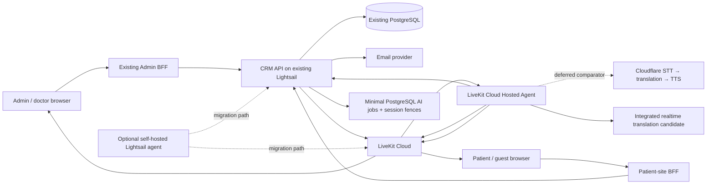

# Low-Cost Multiparty Video Consultations with AI Captions and Translated Speech

**Date:** 2026-08-29

**Status:** Proposed hosted-first V1 and low-cost production fallback; provider, privacy, and clinical quality gates remain blocking

**Primary system:** `medical-crm-v2`

**Related patient frontend:** `medicaltourismchina-platform`

**Replaces:** Nothing. This is a cost-reduced launch profile alongside the enterprise target design dated 2026-08-28.

## 1. Executive decision

Launch secure multiparty video, AI captions, and translated speech without provisioning the enterprise design's ECS/Fargate, ECR, SQS, NAT Gateway, Multi-AZ ElastiCache, IAM Roles Anywhere, or private SigV4 proxy.

The low-cost V1 topology is:

1. Keep the CRM API and a minimal PostgreSQL control plane on the existing API Lightsail instance.
2. Deploy the multiparty interpretation agent to LiveKit Cloud first. This requires zero new AWS servers and preserves server-controlled AI identity, consent enforcement, and output publication.
3. Use Silero VAD plus LiveKit Audio Turn Detector for end-of-turn decisions. Start a measured 600–800 ms cancellable playout grace period at VAD speech-end in parallel with Turn Detector evaluation; never add the same fixed delay again after EOT acceptance.
4. Evaluate OpenAI `gpt-realtime-translate` and `gpt-realtime-2.1-mini` against de-identified medical bilingual material. Do not enable either for PHI until the exact endpoint, account, retention configuration, and contract are approved.
5. Defer the Cloudflare STT → translation → TTS comparator until the first integrated provider works end to end.
6. Keep one 4 GB Lightsail agent as a portability/cost fallback, not a V1 purchase. Add a second only if the self-hosted profile is later selected and availability or capacity requires it.
7. Keep AI output explicitly assistive. The original audio remains available, every participant sees an AI warning, and a human interpreter remains the escalation path for clinically consequential decisions.

This profile targets an initial maximum of eight human participants, Chinese ↔ English, two concurrent AI-enabled rooms, two simultaneous paid provider sessions per room, and no recording or durable transcript by default. Those are launch limits, not untested capacity claims.

## 2. Why this profile exists

The enterprise target design optimizes for autoscaling, multi-AZ state, highly isolated workload identity, and extensively fenced recovery. Those controls are valuable at larger scale, but they introduce a substantial fixed-cost and operational baseline before the first AI-enabled consultation.

The hosted-first V1 accepts the following bounded trade-offs:

- the free LiveKit Build plan may cold-start an idle production deployment, currently documented as up to 10–20 seconds;
- the Build allowance is currently capped at 1,000 hosted-agent session minutes per month and five concurrent sessions; it is a pilot boundary, not a clinical production SLA;
- LiveKit Cloud becomes an additional processor for the agent runtime and must be covered by the applicable privacy contract and configuration;
- paid hosted-agent cost must be measured against the fixed self-hosted Lightsail fallback before scale;
- PostgreSQL is the job queue and source of truth at launch scale;
- no Multi-AZ cache is required because no credential or authorization decision depends on cache survival.

It does not relax room authorization, invitation scope, LiveKit grant restrictions, consent, auditability, or the requirement that AI failure cannot disconnect humans.

## 3. Launch assumptions and limits

| Dimension | Launch value |
|---|---|
| Human participants | Maximum 8 per room |
| Service participants | Maximum 1 interpretation agent per active room generation |
| Languages | Chinese (`zh`) ↔ English (`en`) |
| Concurrent AI rooms | Maximum 2 for V1 even if the LiveKit plan permits more |
| Video provider | LiveKit Cloud |
| Agent runtime | LiveKit Cloud Hosted Agent for V1; self-hosted Lightsail fallback |
| AI features | Source captions, translated captions, translated speech |
| Recording | Off |
| Durable transcript | Off by default |
| Caption replay | Final captions only, in memory for up to 2 minutes |
| Human interpretation | Required escalation path for high-risk clinical communication |

If launch needs more languages, more than two simultaneous AI rooms, 24/7 AI high availability, or regulated-data terms that the chosen self-service vendors cannot provide, this profile must be revised before enablement.

## 4. Architecture



### 4.1 Resource count

Required incremental infrastructure for V1:

| Resource | Count | Purpose |
|---|---:|---|
| Existing API Lightsail | 0 new | API, invitation/email/action/cleanup loops, PostgreSQL job coordination |
| LiveKit Cloud Hosted Agent | 1 deployment | Agent runtime, audio routing, provider connections, translated output publication |
| 4 GB interpretation Lightsail | 0 initially; 1 optional | Self-hosted migration after cost, runtime, or portability trigger |
| Second 4 GB interpretation Lightsail | 0 initially; 1 later optional | Capacity or warm standby only after selecting self-hosting |
| Cloudflare Workers Paid account | 0 for V1 | Deferred inference comparator; never the LiveKit Agent runtime |
| LiveKit Cloud project | Existing or 1 per environment | SFU, TURN, webhooks, room server APIs |

No launch requirement exists for ECS, Fargate, ECR, SQS, NAT Gateway, ElastiCache, Cloudflare Durable Objects, Cloudflare Queues, or Cloudflare Containers.

Both `HOSTED_AGENT_V1` and the optional staff-only `CLIENT_DIRECT_EXPERIMENT` use zero additional Lightsail instances. Unlike client-direct mode, `HOSTED_AGENT_V1` remains a centrally controlled service participant suitable for multiparty evaluation.

Use separate LiveKit projects or otherwise contractually approved environment isolation for development, staging, and production. The free Build plan's cold starts and hard quota are acceptable only for a pilot that can fail closed to AI while leaving human video available. Real-patient production requires an approved LiveKit plan/contract, verified warm-start behavior, and sufficient quota.

## 5. Cloudflare decision

### 5.1 Do not run the LiveKit agent in a Cloudflare Worker

Cloudflare Workers support WebSockets and do not charge for wall-clock duration, but the standard runtime has a 128 MB memory limit, CPU limits, rolling runtime updates, and no conventional always-on process model. Queue consumers are limited to 15 minutes of wall time. A LiveKit interpretation agent is a long-lived WebRTC media participant with audio SDK, codec, track, reconnection, and process-supervision needs.

Therefore:

- do not deploy the LiveKit Agent SDK inside a Worker;
- do not proxy LiveKit audio through a Worker merely to reach Workers AI;
- do not use Durable Objects as the authoritative meeting database;
- do not introduce Cloudflare Queues while PostgreSQL leases meet measured launch load.

Cloudflare Containers could eventually host a conventional agent process, but they add a newer runtime, separate deployment model, network validation, and usage-based compute. Reconsider them only after a staging proof demonstrates LiveKit connectivity, codec/runtime compatibility, predictable sleep behavior, graceful draining, and a lower measured monthly cost than Lightsail.

### 5.2 Deferred Cloudflare cost comparator

After the hosted integrated-provider V1 works, the interpretation agent may compare Workers AI directly from server-side code:

- streaming STT candidate: `@cf/deepgram/nova-3` over WebSocket;
- batch fallback STT: `@cf/openai/whisper-large-v3-turbo`, not for low-latency primary captions;
- translation candidate: `@cf/meta/m2m100-1.2b`, subject to medical bilingual evaluation;
- TTS candidate: `@cf/myshell-ai/melotts`, only for language tags and voices proven by an executable Chinese/English capability test;
- English-only quality candidate: Deepgram Aura; it cannot be the sole Chinese ↔ English launch adapter.

The adapter boundary must allow Cloudflare, OpenAI, xAI, or another provider to be swapped without changing meeting authorization or LiveKit grants. Do not build the decomposed Cloudflare profile in parallel with the first V1: it adds three latency/failure stages before core turn-taking and translation quality are proven.

Workers AI is inexpensive enough to evaluate, but price is not approval. Before real patient audio is sent, confirm contractual terms, processing locations, retention/logging, subprocessors, deletion behavior, and whether the required healthcare/privacy agreement covers each selected model. Cloudflare states that a HIPAA BAA is limited to Enterprise customers; self-service Workers AI must not be assumed to cover PHI.

### 5.3 Client-direct OpenAI WebRTC: valid experiment, not the default multiparty architecture

OpenAI officially supports browser-to-Realtime WebRTC using a short-lived client secret minted by a developer-controlled server. This can remove the interpretation host from a standalone one-user translator or tightly controlled internal pilot:

```text
browser / desktop app
  -> authenticated CRM API requests a short-lived OpenAI client secret
  -> browser connects directly to OpenAI over WebRTC
  -> microphone audio and translated audio do not traverse the CRM API
```

This is a real cost and latency optimization. The existing CRM API should mint the client secret because it already owns meeting authorization; adding a Cloudflare Worker solely as a second auth broker would duplicate trust and add no savings.

For the multiparty medical meeting, however, direct playback returns translated audio to the same browser that supplied the microphone. Delivering that result to everybody else requires the source browser to capture the OpenAI output and republish a second track into LiveKit. That creates material constraints:

- translation stops when that participant's tab sleeps, browser crashes, device changes, or mobile OS throttles it;
- a compromised participant browser can forge captions or republish arbitrary audio as if it were AI output;
- every patient, guest, doctor, and mobile browser must implement and pass the dual-WebRTC/audio-routing path;
- server-side consent withdrawal and generation fencing cannot instantly control an already issued browser session unless the provider lifecycle is explicitly controllable;
- room-wide caption replay, consistent speaker attribution, spend enforcement, and support diagnostics become fragmented across clients;
- autoplay, echo cancellation, audio capture, and feedback behavior vary by browser.

Therefore this design permits client-direct mode only as an explicit `CLIENT_DIRECT_EXPERIMENT` for staff-only or one-to-one evaluation. Multiparty mode remains a server-side service participant: `HOSTED_AGENT_V1` first, or `SELF_HOSTED_AGENT` after a measured migration decision. Promotion of client-direct mode requires a separate threat model and the complete browser/device test matrix; it is not an automatic way to claim zero servers.

In either mode, never ship a standard OpenAI API key to the browser. Only a short-lived provider client secret may leave the backend. The application issuance record is bound to consultation, member, model, language, and auth version; provider session configuration is locked to the narrowest supported values. Issuance must be authorized, rate-limited, metered, and audited.

### 5.4 OpenAI provider candidates

Official current candidates include:

- `gpt-realtime-translate`: dedicated streaming speech-to-speech translation, translated audio plus documented `session.input_transcript.delta` source text and `session.output_transcript.delta` translated text, published at `$0.034` per audio minute;
- `gpt-realtime-2.1-mini`: lower-cost general Realtime voice/reasoning model with WebRTC, WebSocket, SIP, audio input/output, and function calling; evaluate it as a separate translation candidate, but reject it if it paraphrases, explains, omits, or invents clinically material content;
- `gpt-realtime-2.1`: higher-cost comparator for cases where the mini model fails the agreed quality threshold.

General OpenAI Realtime sessions document server VAD, semantic VAD, and `speech_started`, but those capabilities must not be inferred for the dedicated `/v1/realtime/translations` endpoint. Every provider profile has exactly one source-turn authority. For a controllable general Realtime or decomposed adapter, disable provider automatic turn detection so it cannot commit, split, create, or cancel a response; Silero VAD plus LiveKit Audio Turn Detector is authoritative and invokes only documented, executable-tested manual commit/response operations. A profile that cannot disable competing automatic turns cannot use this contract.

### 5.5 V1 end-of-turn and playout policy

V1 uses Silero VAD plus LiveKit Audio Turn Detector. The detector analyzes audio semantics and acoustic cues, supports Chinese and English, and is better suited than energy-only VAD to pauses such as “我们这个产品呢……”. LiveKit currently provides full `v1` at no additional inference cost for agents deployed to LiveKit Cloud; self-hosted agents default to local `v1-mini`. As of this design, AgentSession endpointing defaults tighten to `minDelay=300 ms` and `maxDelay=2500 ms` when the audio detector is used, and a prediction that does not return in roughly one second follows LiveKit's documented commit/fallback behavior. These endpointing waits are part of the detector decision and must not be followed by another fixed 600–800 ms delay.

V1 selects one explicit audience-playout mode: `TURN_GATED_BUFFERED`. The detector and provider run in parallel, but translated speech is turn-based/consecutive rather than audible rolling simultaneous interpretation:

```text
source PCM
  +--> provider receives authorized streaming audio and produces translated events
  +--> Silero VAD speech-end starts the 600–800 ms cancellable grace clock
  +--> LiveKit Audio Turn Detector evaluates true end of turn in parallel

provider event -> verified response/item + causal-range mapper -> local_turn_id
mapped output -> bounded per-turn in-memory buffer; not audible yet
playout requires BOTH grace elapsed AND Turn Detector EOT accepted
do not start another fixed debounce after Turn Detector acceptance
speaker resumes before release -> discard/cancel that turn
speaker remains silent + both gates pass + mapped output reaches proved final/drain barrier
  -> mark PLAYOUT_ELIGIBLE and publish through target-language arbiter
```

Do not wait until the end of a long utterance before uploading all source audio; that would add the utterance duration to provider computation. `COMMIT_AFTER_EOT` is allowed only when the exact endpoint documents and passes a manual-commit test; the dedicated translation endpoint is not assumed to support it. Measure the additional post-EOT delay, and reject the profile as V1 default if it misses the 0.8–1.3 second first-audio gate.

The per-turn audio buffer is capped initially at 30 seconds and 8 MiB. If either cap is reached, discard translated speech for that turn, retain only qualified captions when independently available, keep original audio connected, and ask the speaker to use shorter turns. Never persist this buffer or allow an unbounded utterance backlog.

Explicitly configure and test the `zh` or `en` threshold rather than relying on an English default when no STT language signal exists. Treat the detector as a quality signal, not a guarantee: the current implementation can time out and commit, so interruption, long-pause, short-answer, crosstalk, and fallback behavior remain blocking tests.

For the dedicated `gpt-realtime-translate` endpoint, do not assume undocumented automatic-turn disable, manual commit, response cancel, or input-buffer operations. LiveKit remains the product turn/playout authority; provider segmentation is a transport detail. OpenAI does document `session.close` for a translation source stream and requires clients to continue draining until `session.closed`.

The Phase B safety-first MVP therefore uses one translation session per admitted local speech turn. It opens at Silero speech-start, immediately streams the bounded pre-roll plus live PCM, sends `session.close` at VAD speech-end, and treats `session.closed` as the provider final/drain barrier. The whole provider session maps one-to-one to one `local_turn_id`, avoiding an undocumented cross-turn response mapper. Playback still waits for both the parallel grace timer and LiveKit Turn Detector acceptance. This increases session setup frequency, so cold-start, latency, and billing measurements are blocking; a later continuous-session optimization is allowed only after stable event identity, causal boundaries, and per-turn finality are executable-tested.

Seal the local turn at LiveKit EOT and release it only after mapped output reaches the proved final/drain state. Unknown ownership, a response crossing a local boundary without a deterministic rule, missing finality, or reconnect sequence discontinuity fails closed. If the speaker resumes before release and the endpoint cannot cancel, discard the entire local-turn buffer, close the source session through the existing provider fence, and keep that speaker AI-unavailable until confirmed closure/expiry permits a clean session. If the endpoint cannot provide enough causal/finality signals while still meeting the first-audio target, `gpt-realtime-translate` fails the V1 gate; choose a controllable general Realtime adapter or later decomposed profile instead.

The grace period is a latency/turn-taking policy, not an authorization control. It begins on the monotonic VAD speech-end timestamp while Turn Detector evaluation continues. If the grace period finishes first, output remains buffered until EOT acceptance; if EOT is accepted first, output remains buffered only until the already-running grace period finishes. A speaker resume before release cancels/discards the turn. In hosted or self-hosted central-agent mode this policy runs in the interpretation agent; in `CLIENT_DIRECT_EXPERIMENT` it may run locally.

## 6. AI media pipeline

### 6.1 Track authority

The agent joins LiveKit with `autoSubscribe=false`. It subscribes explicitly only after the CRM API freshly confirms the current room generation, interpretation generation, admitted member, exact microphone track SID, and current consent. It subscribes only to current-generation human microphone tracks registered by verified LiveKit webhooks or a server-side room listing. It must reject:

- its own published tracks;
- other service-participant tracks;
- camera or screen-share audio unless explicitly supported later;
- stale room generations;
- tracks whose member is not currently admitted;
- tracks belonging to a participant who has not consented to AI processing.

Browser-supplied room names, roles, participant identities, track SIDs, and target destinations are never authoritative.

An authenticated member or host may request a launch-language preference through the CRM API, but cannot assert it through browser/LiveKit metadata. The API verifies consultation membership, consent, current generations, and the `zh`/`en` allowlist, then stores `expected_source_language`, the deterministic opposite `target_language`, `language_version`, `set_by_principal_id`, and `set_at` on the authoritative source-track/member configuration. Provider-session creation binds that language version. A requested change may be recorded as pending, but the API first stops the old session and clears its queues. It creates the replacement only after confirmed provider closure, conservative provider expiry, or an executable-tested transfer/resume, then activates the new language version. Changing target or version cannot bypass the active-session fence.

Automatic direction switching is off at launch. Unknown or materially mismatched language suppresses translated speech and asks the user or host to confirm the language while original audio continues. A provider language-confidence signal may flag mismatch but cannot authorize a direction change. Brief code-switching remains best effort in the configured direction; sustained switching requires an explicit language update and session restart.

On consent withdrawal, STOP, member removal, track unpublish, execution invalidation, optional self-hosted lease loss, or generation change, the agent must unsubscribe immediately and within the two-second product bound: stop forwarding frames, flush PCM/VAD/provider-input buffers, cancel or close that source's provider session where supported, purge interim/final replay, discard queued TTS, unpublish affected translated output, and emit an audit event.

Low-cost V1 exposes a single-participant witnessed-withdrawal mutation. Every consent row has a monotonic `version`, and grant/withdrawal mutations serialize with the same consultation -> active job -> consent lock order. In one transaction withdrawal records `REVOKED`, increments the consent version, advances the active job authorization revision, invalidates that participant's current source tracks with the exact new consent version, and writes `CONSENT_CHANGED`. It does not pre-label provider rows orphaned: the next watchdog snapshot drives the agent's synchronous unsubscribe/buffer/playout invalidation first, after which provider closure or the conservative expiry reconciler owns the billing fence. Repeating the same withdrawal is idempotent and does not advance either version again.

The legacy batch-grant mutation is deliberately monotonic: it may create a missing version-1 grant or idempotently confirm an existing `GRANTED` row, but it returns `EXPLICIT_RECONSENT_REQUIRED` for `REVOKED` or `DECLINED`. Therefore a delayed pre-withdrawal request cannot overwrite a completed withdrawal. Re-enabling AI after withdrawal is outside this gated MVP; it requires a separately reviewed re-consent ceremony bound to the current consent version and a fresh, single-use server attestation. Until that mutation exists, the original call continues without AI for that participant.

This remains a lower-cost trust compromise: LiveKit grants `canSubscribe` at room scope, not as an application-enforced per-track consent policy. A compromised hosted or self-hosted agent runtime holding a valid room token could bypass the agent's filtering. Mitigations are one exact agent identity per execution version, `autoSubscribe=false`, minimal provider keys, dispatch/token removal on STOP or invalidation, runtime isolation, and audit/reconciliation. Workloads requiring infrastructure-enforced per-track isolation must use the enterprise profile or a separately reviewed room topology.

### 6.2 Per-speaker processing

Each source microphone track has independent logical state, authorization, language, buffering, captions, and provider-session ownership. The safety-first integrated-endpoint MVP creates one provider session lazily per admitted speech turn instead of opening eight continuous paid streams when the room starts. It keeps a short local PCM pre-roll so the first syllable is not lost, caps concurrently active provider sessions at two initially, and closes/drains each session at the VAD speech-end barrier. A later continuous-session optimization may use a measured idle threshold only after provider billing and cross-turn mapping tests pass.

Different speakers never share one provider session merely because they use the same translation direction: shared context would break speaker attribution, consent withdrawal, cancellation, and crosstalk isolation. Exactly one provider profile is active for a job; launch does not run both profiles simultaneously.

Low-cost V1 uses immediate capacity degradation rather than a promotion queue. An active turn is not preempted. If both provider slots are occupied, a third simultaneous speaker's current speech turn is not sent to AI, `AI_CAPACITY_UNAVAILABLE_FOR_SPEAKER` is published without audio or transcript content, and original human audio continues. Slot release never starts translation halfway through that discarded utterance or replays stale pre-roll; the speaker may compete again only on a later explicit speech-start. A session in `CLOSING` or `ORPHAN_WAIT` still occupies its slot until the existing provider-session fence releases it.

`INTEGRATED_REALTIME` is:

```text
LiveKit source track
  -> PCM resample / optional local VAD
  -> integrated realtime translation session
  -> provider-documented response/item IDs + translated audio/transcript deltas
  -> verified causal-range/finality mapper -> local_turn_id
  -> validated translated captions and target-language LiveKit audio publication
```

The current official translation guide documents separate source (`session.input_transcript.delta`) and translated (`session.output_transcript.delta`) transcript streams. The executable qualification must still prove language-pair accuracy, ordering, completeness at `session.closed`, reconnect behavior, and whether interim deltas can be safely shown. If those tests fail, select `DECOMPOSED`; do not silently add a parallel STT stream, because that would create a hybrid profile with duplicate audio upload and additional billing requiring separate review.

`DECOMPOSED` is:

```text
LiveKit source track
  -> PCM resample / VAD
  -> streaming STT
  -> source interim caption
  -> final source segment
  -> text translation
  -> translated final caption
  -> TTS chunk
  -> target-language LiveKit audio publication
```

With `INTEGRATED_REALTIME`, suppressing or unpublishing translated audio is a local UX/capacity action; it does not prove the provider stopped generating or billing audio. An integrated provider failure may remove both translated captions and speech for that source. With `DECOMPOSED`, TTS can fail or be disabled while source/translated captions continue. Do not claim component-level provider isolation for the integrated profile.

Caption segments carry server-derived:

- consultation ID;
- room generation;
- interpretation generation;
- source member ID and display label;
- source track SID;
- source and target language;
- language version and current agent execution version;
- monotonic segment sequence;
- source start/end time;
- final/interim state.

The provider cannot choose consultation, member, destination, language authority, or LiveKit identity fields.

### 6.3 Caption delivery

The agent publishes captions through a dedicated LiveKit data topic. Clients accept caption messages only from the API-designated exact current interpretation-agent identity and validate the current room/interpretation generation, language version, agent execution version, and schema version.

Interim captions are best effort and never stored. Final captions may be retained in the agent's memory for at most two minutes and replayed only to a newly reconnected, currently authorized participant. No transcript is written to PostgreSQL unless a later product and retention decision explicitly enables it.

### 6.4 Translated speech delivery

For Chinese ↔ English launch:

- Chinese source speech produces English translated captions and an English audio track;
- English source speech produces Chinese translated captions and a Chinese audio track;
- listeners choose original only, translated only, or original with translated-audio ducking;
- the original audio is always recoverable with one control;
- translated audio is visibly labeled as AI-generated;
- the agent never subscribes to its own translated tracks, preventing feedback loops.

Each target language has one agent-memory-only playout arbiter. It never mixes two translated speakers. Turns are ordered by `PLAYOUT_ELIGIBLE_at`, then source member ID and segment sequence. The 0.8–1.3 second first-audio objective applies to an uncontended arbiter; contention is an explicit degraded state. An item waiting more than five seconds after becoming eligible, or whose execution/consent/language version becomes stale, is discarded; qualified captions may remain. If any human speech resumes while translated audio is playing to that group, stop and discard the remaining translated speech rather than speaking over the human. Chinese → English and English → Chinese use separate arbiters because they serve different target-language groups.

With `INTEGRATED_REALTIME`, the agent buffers provider-translated audio by source turn and releases it through the arbiter only after `TURN_GATED_BUFFERED` eligibility; there is no application TTS queue. If the original speaker resumes before release, or arbiter wait exceeds five seconds, it discards that turn's speech and closes the source session if it cannot recover. It may keep captions active only if the exact endpoint has proved that transcript delivery survives audio suppression or cancellation.

With `DECOMPOSED`, TTS begins only from final or explicitly stable partial translation segments. The same target-language arbiter serializes speech, drops superseded queued partials, and discards speech while keeping captions active when eligibility wait exceeds the cutoff.

### 6.5 Medical safety behavior

- UI text states that captions and speech are AI-generated and may be wrong.
- Numbers, medication names, allergies, negation, laterality, dates, and doses receive glossary/high-risk term highlighting where supported.
- Participants can reveal the source caption beside its translation only for a provider profile qualified to supply both; the complete launch feature set requires this capability.
- A host can stop AI without ending the human room.
- `INTEGRATED_REALTIME` failure may remove translated captions and speech together. `DECOMPOSED` degrades speech first, then translated captions, then source captions. The base call remains connected in both profiles.
- The application does not use translations for diagnosis, orders, consent, or clinical record automation without human confirmation.

## 7. PostgreSQL orchestration instead of SQS

PostgreSQL remains the source of truth and launch-scale queue.

### 7.1 Minimal tables

Add or retain these bounded records:

1. `video_consultation_interpretation_jobs`
   - one row per consultation/room/interpretation generation;
   - desired state, status, language pair, consent policy version;
   - current LiveKit dispatch/agent identity, monotonically increasing execution version, and one-time capability-exchange state;
   - assigned worker ID, lease version, lease expiry, and heartbeat only after self-hosting is enabled;
   - failure code, started/stopped timestamps;
   - provider profile, maximum AI duration, reserved/estimated-consumed micro-dollars, soft/hard budget state;
   - unique active job per consultation generation.
2. `video_consultation_interpretation_events`
   - append-only START, DISPATCH, STOP, FAIL, COMPLETE events; add CLAIM, HEARTBEAT_LOST, and TAKEOVER only for self-hosting;
   - no raw audio, transcript, provider secret, or LiveKit token.
3. `video_consultation_source_tracks`
   - current human microphone authority derived from LiveKit state;
   - expected source language, target language, language version, setter and set timestamp;
   - published/unpublished timestamps and current generation.
4. `video_consultation_ai_consents`
   - participant, policy version, monotonic consent version, granted/declined/revoked state and audit attribution.
5. `video_consultation_provider_sessions`
   - one row per job and source track provider session;
   - provider/profile, opaque provider session/reference ID when supplied, job and source-track IDs;
   - room/interpretation generation, source/target language, language version, and agent execution version;
   - assigned worker ID and lease version only for the self-hosted profile;
   - state, created/last-seen/application-deadline/provider-expiry/closed timestamps;
   - close capability/result, orphan-risk state, and non-content metering counters;
   - a PostgreSQL partial unique constraint permits at most one `CREATING`, `ACTIVE`, `CLOSING`, or `ORPHAN_WAIT` row per job, source track, and interpretation generation; language fields are deliberately excluded so a direction change cannot bypass the billing fence;
   - never provider secrets, raw audio, captions, transcripts, or reusable credentials.
6. `video_consultation_hosted_deployments`
   - deployment ID, bootstrap-secret digest, enabled/revoked state, created/rotated/revoked timestamps;
   - no raw bootstrap secret and no authority beyond exchanging a verified dispatch for a job-scoped capability.
7. `video_consultation_interpretation_hosts` — deferred until self-hosting
   - random installation ID, bearer-secret SHA-256 digest, enabled/revoked status;
   - maximum jobs, created/rotated/revoked timestamps and operator attribution;
   - never the raw host bearer secret.

Do not add a separate capacity subsystem until one of these becomes true:

- more than two concurrent AI rooms are required;
- multiple simultaneous providers per source track;
- automatic cross-host takeover is enabled;
- measured scheduling contention shows that the job and provider-session constraints are insufficient.

### 7.2 Hosted V1 dispatch and execution fence

- START atomically increments `agent_execution_version`, reserves budget, and requests one named LiveKit Hosted Agent dispatch for the exact room and interpretation generation.
- LiveKit encrypted runtime secrets contain one random deployment-scoped bootstrap secret. The API stores only its digest and grants it only `exchange_hosted_dispatch`; it cannot read arbitrary consultations, mint LiveKit tokens, STOP jobs, or reach PostgreSQL.
- Dispatch, room, participant, and track metadata contain only non-secret identifiers such as job ID, dispatch ID, and execution version. Never put a bearer, job capability, provider key, or reusable credential in metadata, observability fields, URLs, or logs.
- Over TLS, the dispatched agent presents the bootstrap secret plus current dispatch identifiers to an exchange endpoint. The API verifies the active job, stored dispatch ID, exact room/generations/execution version, and an atomic unused exchange slot. One successful exchange consumes the slot and returns an opaque random job capability while storing only its digest.
- The job capability is bound to job, dispatch, execution version, audience, and application deadline. It can call only that job's authorization-watchdog, provider-session, metering, and event endpoints. STOP or execution increment invalidates it immediately; crash/redispatch creates a fresh exchange slot and cannot reuse the old capability.
- Every agent mutation and output carries job ID, room generation, interpretation generation, exact agent identity, and execution version. Conditional updates and clients reject stale versions.
- A job-level execution-authorization watchdog keeps at most one refresh in flight every 500 ms. Each request carries a strictly increasing execution-local `request_seq` and random nonce. The response echoes both and carries job/generations/execution version, a job-level monotonic `authorization_revision`, and every track's consent/language versions. STOP, execution invalidation, or any consent/track/generation authority change increments the applicable revision/version in the same database transaction.
- The agent accepts a response only when execution and nonce match, `request_seq` is newer than the last accepted sequence, authorization revision is not below the highest observed revision, and no track version moves backward. Duplicate, reordered, or regressing responses fail closed and never restore a stopped track. A process restart obtains a new execution/capability before resetting local sequence state.
- Authorization expires at `request_started_monotonic + 1.5 seconds`, never 1.5 seconds after response arrival. A response taking more than 400 ms is discarded and cannot extend the existing deadline. The agent uses a monotonic clock and checks the deadline plus exact-track snapshot at every PCM-to-provider boundary; request sequences do not require a database write.
- On STOP, consent withdrawal, track/generation change, execution invalidation, or watchdog expiry, the agent immediately stops affected provider-bound frames, clears buffers, closes the provider session or records `ORPHAN_WAIT`, and unpublishes output. API/network loss therefore fails AI closed while human media continues. The 500 ms/1.5 second values must pass end-to-end failure injection with cleanup inside the two-second product bound.
- `STOP` is monotonic for a generation. It immediately requests dispatch/participant removal, invalidates the capability/execution version, and cannot be reversed by a late callback. Async LiveKit removal is defense in depth; the watchdog supplies the privacy and billing deadline.
- Restart or redispatch cannot create a replacement provider session until the old session is confirmed closed, conservatively expires in `ORPHAN_WAIT`, or an executable-tested provider transfer/resume succeeds. The active-session partial unique constraint remains the billing fence.
- A hosted runtime must not receive PostgreSQL credentials, LiveKit server API secrets, invitation secrets, or unrestricted CRM credentials.

This is the minimum V1 control plane. It adds one small exchange endpoint and one job-level watchdog, not host registration, ownership leases, Redis, SQS, mTLS, or a new auth service. LiveKit handles container lifecycle and scaling; the CRM still owns consent, application state, provider-session idempotency, cost limits, and which output identity clients trust. A leaked deployment bootstrap secret remains a deployment-wide trust compromise, so exchange attempts are rate-limited, alerted, and covered by immediate secret rotation.

### 7.3 Optional self-hosted lease protocol

Implement host registration, bearer rotation, job polling, heartbeats, leases, takeover, and capacity advertisement only when moving to `SELF_HOSTED_AGENT`. At that point, use a random per-host 256-bit bearer stored as a digest by the API, no database route from the agent, 30-second leases with 10-second heartbeats, conditional mutations bound to host and lease version, old-agent removal before takeover, and the same provider closure/expiry/transfer fence. Duplicate audio or billing is less acceptable than a short AI interruption.

## 8. API and invitation security

The low-cost profile retains the important controls from the enterprise design:

- meeting invitations are random, consultation-scoped, single-use, expiring, revocable, and stored only as digests;
- invitation redemption creates a database-backed browser session and consultation binding;
- a five-minute redemption recovery window may retry only with the same purpose-bound browser bootstrap nonce digest, preventing a lost HTTP response from permanently consuming the invitation;
- Admin and doctor admission derives from authenticated CRM principal and consultation membership, not from an external invitation;
- LiveKit credentials are minted by `apps/api`, last no more than 15 minutes for initial connection, and derive room, stable identity, grants, and role from database state;
- all human tokens explicitly deny room-admin and metadata-update privileges;
- moderation, removal, room close, and token revocation are server-side LiveKit operations and audit events;
- join, leave, reconnect, invitation, consent, AI start/stop, hosted dispatch, optional self-hosted claim, and provider failures are auditable;
- the browser never receives LiveKit API secret, provider key, Cloudflare API token, or email-provider secret.

The exact two-minute Valkey credential-escrow protocol from the enterprise design is not used. Recovery is based on a narrowly scoped database redemption state and a browser-held bootstrap secret whose digest is stored. No authorization depends on a cache, so Redis/Valkey is not a launch dependency.

## 9. Agent deployment

### 9.1 Existing API Lightsail

Run these as separate least-privilege systemd units or timers on the existing host:

- `medora-crm-v2-api`;
- `medora-video-email-worker`;
- `medora-video-actions-worker`;
- `medora-video-reconcile-worker`;
- `medora-video-cleanup-worker`;
- `medora-video-ai-dispatch-worker`.

They are processes, not separate servers. Each unit has restart limits, a health timestamp, structured redacted logs, and a dedicated database role where practical.

### 9.2 LiveKit Cloud Hosted Agent V1

Deploy the agent as a named production deployment with a pinned SDK/runtime and explicit region. LiveKit Cloud manages builds, container lifecycle, scaling, health checks, and rollback. V1 still enforces a CRM-side maximum of two simultaneous AI rooms.

The free Build plan is for de-identified/internal evaluation only: it can scale production to zero, cold-start by 10–20 seconds, permits at most five concurrent sessions, and stops accepting new work after its included 1,000 agent session minutes. Before real-patient use, verify a paid/contracted plan keeps production warm, has sufficient quota and support, and covers the selected region and agent-hosting data flow.

Agent Observability can include transcripts, traces, logs, and audio recordings with a retention window. Apply two independent privacy layers for this product unless content capture is separately approved: keep Agent Observability disabled in the LiveKit project's Data and privacy settings, and explicitly start every clinical Node AgentSession with `record: false`:

```ts
await session.start({
  agent,
  record: false,
});
```

Omitting `record` is forbidden for any path that creates a LiveKit `AgentSession`, because the SDK can defer to the server-side job/project recording setting. In the pinned Node SDK, `record: false` disables upload of session audio, transcript, traces, and logs. Such a path must use the repository's tested `privateAgentSessionStartOptions(agent)` helper so a future refactor cannot silently rely on Dashboard configuration alone. The current low-level RTC media adapter does not create an `AgentSession`, so that option is not invoked there; it must instead pass an executable no-AgentSession/no-upload check while project Agent Observability remains off. Verify the effective project setting and session behavior before any PHI; application logs remain redacted even if LiveKit offers richer observability.

### 9.3 Optional interpretation Lightsail

If a measured migration trigger selects self-hosting, start with Linux 4 GB RAM, 2 vCPU and run:

- one `medora-video-interpretation` supervisor;
- one isolated child process/task per active room;
- maximum two active rooms until load tests approve more;
- systemd `Restart=on-failure` with bounded backoff;
- automatic security updates in a maintenance window;
- host firewall allowing only SSH through an operator allowlist and required outbound traffic;
- no public application listener unless a health endpoint is protected by the API host or monitoring allowlist.

The host does not hold the LiveKit server API secret. It requests a short-lived, generation-bound agent participant token from `apps/api` after a valid job claim. If local LiveKit Turn Detector `v1-mini` is used, soak-test CPU and inference timeouts: LiveKit recommends compute-optimized rather than burstable hosts for that model, so the standard `$24` Lightsail bundle is not assumed adequate.

### 9.4 Secrets

For `HOSTED_AGENT_V1`, use LiveKit's encrypted runtime-secret injection for the smallest provider credential set and the deployment bootstrap secret, do not include secrets in the build context, and rotate them independently from deployments. The bootstrap can only exchange a verified dispatch for a job capability; it is never placed in LiveKit metadata. Confirm the contract and project access controls before PHI.

For the optional self-hosted profile:

- store secrets outside the repository in root-owned files under `/etc/medora/` with mode `0600`, and expose them to the non-root systemd service through `LoadCredential=` or an equivalently scoped runtime credential file;
- give the service only its per-host CRM bearer and the provider keys it needs;
- keep API signing, invitation HMAC, and LiveKit server secrets off the interpretation host;
- never place secrets in command-line arguments, logs, systemd unit text committed to git, or health responses;
- document 90-day rotation and immediate incident rotation;
- prohibit whole-instance Lightsail snapshots after any live secret has been provisioned, because individual `/etc` files cannot be excluded from an instance snapshot;
- treat the interpretation host as disposable: rebuild it from pinned automation and inject secrets separately from an offline encrypted recovery copy with access logging;
- use only a separately built secret-free base image if an image is needed for faster recovery; never promote a running secret-bearing instance into that image.

This is operationally simpler but weaker than workload identity. Upgrade to a managed secret/workload-identity design before autoscaling to untrusted or ephemeral compute.

## 10. Capacity and backpressure

Launch limits are enforced by the API, not merely by runtime or plan convention:

- maximum 2 active AI rooms for V1 regardless of hosted-plan quota;
- maximum 2 concurrent paid provider sessions per room, dynamically assigned to speaking tracks without sharing state between speakers;
- maximum 8 humans in one room;
- maximum 8 subscribed human microphone tracks;
- maximum one target-language speech queue per supported target language;
- maximum caption text length and TTS queue depth;
- provider per-minute, per-room, daily, and monthly budget caps;
- tenant-level concurrent AI room cap;
- reject new AI START with `AI_CAPACITY_UNAVAILABLE` while keeping video available.

Before START, PostgreSQL atomically reserves a conservative worst-case amount using the approved provider rate, maximum AI duration, and the configured maximum concurrent paid provider sessions. Raising that concurrency cap requires an incremental reservation first. Merely subscribing locally to another consented track does not create a paid session; provider activation must acquire one of the reserved slots. The job stores reserved and locally estimated consumed micro-dollars without caption or transcript content.

Budget enforcement runs at least every five seconds from local provider-audio/wall-clock counters rather than waiting for delayed vendor invoices:

- a soft threshold warns operators/users and rejects new AI START or new source-stream reservations;
- for `DECOMPOSED`, soft shedding first stops TTS, then reduces interim-caption frequency;
- for `INTEGRATED_REALTIME`, locally muting audio may protect UX/CPU but does not count as cost shedding;
- a hard per-room or tenant threshold closes every billed provider session for the affected job, prevents restart in that interpretation generation, and marks AI `BUDGET_EXHAUSTED` while the human call continues;
- bounded overrun is limited to one five-second enforcement interval multiplied by active source streams and the configured provider rate, plus documented provider billing granularity. Keep an additional safety margin in the reservation.

Operational load shedding, separate from a hard cost cap, is profile-specific:

1. `DECOMPOSED`: stop TTS and retain captions;
2. `INTEGRATED_REALTIME`: unpublish translated audio if local media capacity is constrained, while acknowledging the provider session may continue billing until closed;
3. reduce interim caption publication frequency;
4. admit no new AI rooms or source tracks;
5. at the hard resource/cost boundary, close provider sessions and stop AI;
6. never shed or disconnect human LiveKit media.

Event-loop lag, provider RTT, caption latency, turn-decision latency, speech lag, active tracks/sessions, cold starts, and restart count are measured in both runtimes. For self-hosting, also require a 90-minute soak with memory below 70%, sustained CPU below 65%, no local Turn Detector timeouts or agent-caused audio gaps, and translated-caption p95 latency within the approved product target.

## 11. Cost model

All figures are estimates in USD and must be rechecked before purchase.

### 11.1 Runtime comparison

| Item | Hosted Build pilot | Hosted paid production candidate | One self-hosted Lightsail |
|---|---:|---:|---:|
| New AWS server | $0 | $0 | ~$24/month |
| Hosted-agent allowance/cost | 1,000 session min included; hard cap | Recheck current plan + usage price | $0 hosted-agent compute |
| Cold start | Up to 10–20 seconds when scaled to zero | Production documented to stay warm on paid plans; verify | Process normally warm; operator-managed |
| Maximum concurrency | 5 plan sessions; application caps at 2 | Plan-specific; application caps at 2 initially | 2 rooms until soak passes |
| Operations | Managed build/lifecycle/scaling | Managed build/lifecycle/scaling | Patching, secrets, monitoring, rebuilds |
| Incremental fixed subtotal | **$0 within allowances** | **Plan/usage dependent** | **~$24/month** |

LiveKit media, hosted-agent session time, observability, downstream data, and AI inference are separate metered dimensions subject to plan allowances. An agent also counts as a connected participant. The Build profile is a cost-free pilot boundary, not a guarantee that clinical production costs `$0`.

### 11.2 Cloudflare AI reference rates as of 2026-08-29

Current published examples include:

- Nova-3 streaming STT: `$0.0092` per WebSocket audio minute;
- Whisper Large v3 Turbo batch STT: about `$0.0005` per audio minute;
- M2M100 translation: about `$0.342` per million input tokens and the same per million output tokens;
- MeloTTS: about `$0.0002` per generated audio minute;
- Workers Paid platform minimum: `$5/month`, with a daily Workers AI free allocation before usage charges.

Do not budget MeloTTS until Chinese and English voice quality, language parameters, latency, and clinical comprehensibility pass an executable test. A more expensive TTS provider may be required.

Conservative STT example for a 60-minute consultation:

| Continuously streamed source tracks | Billable source audio minutes | Nova-3 STT estimate |
|---:|---:|---:|
| 2 | 120 | ~$1.10 |
| 4 | 240 | ~$2.21 |
| 8 | 480 | ~$4.42 |

Do not assume silence/VAD discounts until billing telemetry proves them. Translation and TTS are additional, as are LiveKit connection/bandwidth charges. The product must record per-meeting metering without storing transcript content and enforce configurable daily and monthly spend caps.

### 11.3 OpenAI Realtime reference rates as of 2026-08-29

OpenAI currently publishes `gpt-realtime-translate` at `$0.034` per audio minute for translated audio plus transcript deltas. The frequently quoted `$2.04` for a one-hour meeting is correct only for one billable 60-minute source stream:

| Continuously active source sessions | Billable audio minutes in a 60-minute meeting | `gpt-realtime-translate` estimate |
|---:|---:|---:|
| 1 | 60 | ~$2.04 |
| 2 | 120 | ~$4.08 |
| 4 | 240 | ~$8.16 |
| 8 | 480 | ~$16.32 |

The exact billing behavior for silence, reconnection, overlapping speakers, lazy session creation, idle closure, and translation-session lifecycle must be measured against the production account. V1 caps simultaneous paid sessions at two, but may serve more speakers sequentially; it does not share provider context between them. Do not market a flat `$2.04/hour` multiparty cost until metering proves the actual billable audio.

`gpt-realtime-2.1-mini` currently publishes audio token rates of `$10` per million input audio tokens and `$20` per million output audio tokens, plus text/reasoning usage where applicable. Because audio tokens do not map to meeting minutes with one universal constant, estimate this candidate from real usage telemetry rather than inventing a per-minute price.

### 11.4 Cost decision

The recommended V1 budget is:

```text
existing platform cost
+ LiveKit Hosted Agent/media/observability usage after included allowances
+ selected OpenAI usage
+ $0 new AWS servers initially
```

Defer Cloudflare inference spending until its comparator phase. Re-evaluate self-hosting when measured hosted-agent runtime cost materially exceeds `$24/month`, when cold-start/runtime constraints remain unacceptable, or when portability/contract requirements favor it. Cost alone cannot override the provider and PHI gates.

## 12. Reliability and recovery

| Failure | Required behavior |
|---|---|
| Hosted Agent process/container failure | Human call continues; UI marks AI reconnecting; stale execution output is rejected; redispatch waits for the provider-session fence |
| Hosted Build cold start or quota exhaustion | Human call continues; UI marks AI unavailable/reconnecting; never bypass the quota or silently start unbudgeted processing |
| Optional self-hosted process/host outage | Human call continues; restart/takeover follows the lease and provider-session closure/expiry/transfer fence |
| `INTEGRATED_REALTIME` provider outage | Translated captions and speech for that source may fail together; close the session, show AI degraded, and use bounded retry only if generation/consent/budget remain valid |
| `DECOMPOSED` STT outage | Stop downstream translation/TTS for that source and show AI degraded |
| `DECOMPOSED` translation failure | Show source captions only; do not synthesize guessed speech |
| `DECOMPOSED` TTS failure | Keep source and translated captions; original audio remains active |
| API/database outage | Agent stops provider-bound processing when its short-lived authorization cannot be refreshed; human LiveKit media continues |
| LiveKit webhook loss | API reconciliation lists the room and repairs current participant/track state |
| Room generation changes | Old job becomes STOP; old dispatch/identity is removed; new generation requires a new execution version and dispatch |
| Soft cost threshold | Reject new AI jobs/source streams; `DECOMPOSED` may disable TTS first |
| Hard cost threshold | Close all billed provider sessions for the job and stop AI; never terminate base video |

Retries are bounded and jittered. Provider operations use idempotency keys where supported. Logs contain provider request IDs and redacted error classes, never audio, captions, invitation tokens, cookies, or credentials.

Every provider session has an application deadline and maximum lifetime. If an agent loses the provider response or crashes after session creation, reconciliation must close the known session when the exact transport supports server-side closure; otherwise it stops all input, records an orphan-risk event, and waits through a conservative provider expiry before releasing its capacity budget. A provider/transport with neither bounded expiry nor observable closure cannot be the production default.

## 13. Privacy, consent, and compliance gates

Before enabling AI for real consultations:

- identify which privacy/healthcare laws and contracts apply to the actual patients, hospitals, regions, and vendors;
- execute required data-processing agreements and, if applicable, BAAs;
- verify that LiveKit Cloud and every STT/translation/TTS provider contract covers the data flow;
- verify LiveKit Agent hosting, Turn Detector inference, secrets, observability, regions, and any content retention are covered and correctly configured;
- disable provider content logging/training where configurable;
- document processing regions, subprocessors, retention, deletion, and incident notification;
- obtain explicit participant consent before subscribing their track for AI processing;
- allow consent withdrawal, which stops forwarding that participant's audio within two seconds;
- keep recording and persistent transcript off unless separately approved;
- conduct a threat model and focused penetration test before public rollout.

If HIPAA applies, do not send PHI through Lightsail or a self-service AI plan merely because the implementation is technically possible. As of this design date, Lightsail is not named in AWS's HIPAA-eligible services list, and Cloudflare states that BAAs are limited to Enterprise customers. Use only services and account terms explicitly approved for the workload, or keep the pilot de-identified and non-clinical.

OpenAI's current HIPAA-eligible API list requires an executed BAA and an organization provisioned with Modified Retention. It lists `/v1/realtime`, `/v1/audio/transcriptions`, `/v1/audio/translations`, and `/v1/audio/speech`, but does not currently list the dedicated `/v1/realtime/translations` endpoint used by `gpt-realtime-translate`. Do not send PHI to that dedicated endpoint unless OpenAI confirms in writing that the exact endpoint and approved organization are covered. `gpt-realtime-2.1-mini` over `/v1/realtime` is still subject to the executed BAA, Modified Retention, exact configuration, and translation-quality gates; endpoint eligibility alone does not make its output clinically safe.

Cloudflare's statement that customer content is not used to train LLMs is useful but does not replace a healthcare contract, data-processing review, or model-specific subprocessor review.

## 14. Provider qualification

No provider becomes the clinical launch default on price alone.

Run a de-identified Chinese/English corpus covering:

- symptoms and duration;
- medication names and doses;
- allergies;
- diagnoses and procedures;
- negation;
- numbers, dates, time, and measurements;
- left/right laterality;
- accents, code-switching, interruptions, crosstalk, and background noise.

Measure:

- source word/character error rate for every profile claiming source captions;
- terminology and semantic accuracy;
- critical-number accuracy;
- omission/addition rate;
- speaker attribution;
- interim and final caption latency;
- translated-speech start latency and maximum lag;
- reconnect/recovery behavior;
- cost per source-track minute and per meeting.

For the exact integrated translation endpoint, a blocking executable test determines whether each transcript delta is source text, translated text, or both; whether it is interim or final; how it maps to a speaker/segment; and how sequencing behaves after reconnect. A profile that cannot prove source-language transcripts does not meet the complete source-caption requirement.

Clinical operations defines blocking thresholds before translated speech is enabled. Until then, the feature remains staff-only or allowlisted with prominent evaluation labeling.

## 15. Delivery phases

### Phase A: Secure multiparty foundation

- move all room/grant authority into `apps/api`;
- implement scoped invitations, browser bindings, short LiveKit tokens, server-side moderation, consent, audit, and verified webhooks;
- keep AI flags off;
- validate 2/4/8-party calls across real networks.

### Phase B: Zero-new-server Hosted Agent MVP

- deploy one named LiveKit Cloud Hosted Agent in an isolated non-PHI project;
- implement the minimal job, consent, execution-version, provider-session, and budget records;
- add Silero VAD, LiveKit Audio Turn Detector, explicit `zh`/`en` handling, parallel provider streaming, and cancellable playout buffering whose VAD grace clock runs in parallel with Turn Detector evaluation;
- require every clinical `AgentSession.start` call to set `record: false` through the tested privacy helper, in addition to disabling project Agent Observability;
- lazily create speaker-isolated provider sessions with a concurrency cap of two and PCM pre-roll;
- A/B `gpt-realtime-translate` and `gpt-realtime-2.1-mini` on de-identified medical bilingual material;
- run long-pause, interruption, billing, cold-start, quota, reconnect, and 2/4/8-party tests.

Implementation status on 2026-08-29: the repository contains the dedicated WebSocket adapter, source/translated caption parsing, translated PCM buffering, server-listed microphone reconciliation, watchdog-bound explicit subscriptions, two-session cap, per-turn `session.close`/`session.closed` finality, target-language LiveKit audio publication, and a synthetic/de-identified capability probe. The non-overridable production media gate remains `false`. On the current development machine, both HTTPS and WebSocket TLS connections to `api.openai.com:443` are reset before authentication, and no LiveKit project credentials are configured; therefore real provider output and an end-to-end LiveKit room have not yet passed. Do not describe Phase B as complete or enable real-patient audio until both tests pass and review is clean.

Provider admission writes a server-owned conservative expiry bound for every `CREATING` row, including the connect-before-activate crash window. Admission and a later consultation START reconcile elapsed bounds transactionally, move the unresolved fence to audited terminal `FAILED`, and never use `application_deadline_at` as provider-closure evidence. The pinned OpenAI translation profile currently reserves two hours plus five minutes of skew/drain margin. This is code scaffolding, not a verified provider claim: production enablement additionally requires official contract evidence and an executable exact-endpoint test proving that `/v1/realtime/translations` cannot outlive that bound. If that proof fails, increase the bound from verified provider terms or keep the profile disabled; never shorten it from an agent-supplied timestamp.

### Phase C: Contracted real-patient launch

- select only a provider/model/endpoint with approved privacy terms and passing source-caption, translation, latency, and safety gates;
- move Hosted Agent production to the approved warm plan and region with sufficient quota;
- verify project Agent Observability is disabled, every clinical session explicitly starts with `record: false`, no audio/transcript/trace/log upload occurs, and all required BAAs/DPAs are executed;
- enable translated captions/audio for an allowlist, with original/translated/ducking controls and human escalation;
- keep the Cloudflare decomposed comparator deferred unless the integrated profile cannot meet cost or feature requirements.

### Phase D: Optional self-hosted migration

Provision one 4 GB Lightsail only after a measured hosted-cost, runtime, portability, or contractual trigger. First prove that the bundle can run the selected media pipeline and local Turn Detector without CPU-credit timeouts; otherwise choose suitable compute rather than forcing the `$24` target. Implement host secrets, leases, heartbeat, rebuild, and takeover only in this phase. Add a second host only after self-hosting is selected and capacity or availability requires it.

## 16. Verification and launch gates

### 16.1 Common video gates

- browser cannot choose room, role, identity, human grants, or caption destination;
- invitation replay, room hopping, token replay after revocation, and cross-consultation cookies fail;
- every human token decodes to `roomAdmin: false` and metadata update disabled;
- base human call survives every injected AI failure;
- secrets and raw credentials are absent from git, database rows, logs, metrics, and process arguments;

### 16.2 Central-agent production gates

These gates are blocking for multiparty clinical launch:

- agent joins with `autoSubscribe=false`; no source audio reaches it before fresh admission/track/generation/consent authorization;
- forged caption packets and human-published translated audio are ignored as AI output;
- consent withdrawal unsubscribes, stops provider-bound audio, purges source buffers/replay/TTS, and unpublishes affected output within two seconds;
- agent runtime cannot sign LiveKit tokens, administer rooms, or reach PostgreSQL;
- provider-session partial uniqueness, crash/orphan/expiry reconciliation, and budget reservation/release converge without duplicate sessions or double billing;
- redispatch/restart waits for proved provider closure, conservative provider expiry, or tested transfer/resume; `ORPHAN_WAIT` cannot be relabeled closed to bypass the fence;
- agent crash/restart, provider disconnect, API outage, execution invalidation, and room generation change produce no feedback loop or duplicate translated speech; stale-execution captions/audio fail the client fence;
- language selection/update, unknown language, mismatch, and code-switching tests match the server-authorized language-version policy;
- every selected profile proves one source-turn authority: controllable profiles disable provider automatic turn detection and use documented manual commit from LiveKit EOT; no second detector may split/commit/cancel independently;
- the Phase B per-turn translation-session profile proves session-open latency, ordered deltas, `session.close`/`session.closed` drain semantics, resume behavior, and reconnect failure closure before any mapped output is released; any later continuous-session profile additionally proves stable response/item identity, causal input range or equivalent boundary, cross-local-turn handling, and reconnect continuity; arrival-time/silence heuristics are forbidden;
- exact integrated-endpoint tests prove transcript meaning/finality/mapping/reconnect behavior and any claimed cancellation operation before those capabilities are enabled; a profile without unique mapping/finality fails closed and is not the V1 default;
- Silero VAD plus LiveKit Turn Detector passes Chinese/English long-pause, short-answer, interruption, backchannel, crosstalk, timeout, and fallback tests; the 600–800 ms monotonic grace clock starts at VAD speech-end in parallel with detector evaluation, no second fixed delay is added after EOT acceptance, and measured playback begins within the approved 0.8–1.3 second product window after true end of turn;
- `TURN_GATED_BUFFERED` proves source upload/provider computation remains streaming while no translated speech is audible before EOT; 30-second/8-MiB overflow degrades without unbounded storage, and `COMMIT_AFTER_EOT` cannot silently substitute if it misses the latency gate;
- lazy per-speaker activation preserves bounded PCM pre-roll and attribution, never shares provider context across speakers, enforces two active slots, and accounts correctly for idle close/reopen;
- three-speaker overlap, same-target-language simultaneous turns, immediate third-speaker turn degradation, capacity UI, arbiter serialization, five-second eligible-item expiry, later-turn slot retry, and resume/STOP stale-drop tests pass;
- the selected/enabled production provider profile passes its complete failure, load-shedding, cost, privacy, and capability tests; an unimplemented/deferred profile is absent from the runtime allowlist and does not block V1;
- if `INTEGRATED_REALTIME` is selected, test joint caption/audio failure, transcript semantics, local suppression, endpoint cancellation, and billing behavior; if `DECOMPOSED` is later enabled, separately test STT → translation → TTS stage failures and degradation order before enablement;
- soft and hard budget thresholds stop the correct work within the five-second enforcement interval plus documented provider granularity.

### 16.3 `HOSTED_AGENT_V1` gates

- Build-plan testing uses only synthetic or properly de-identified audio and fails AI closed on cold start, five-session concurrency limit, or 1,000-minute hard quota;
- real-patient production uses an approved warm plan/region and executed contracts covering agent hosting, Turn Detector, secrets, and observability;
- executable privacy tests confirm project Agent Observability is off and session-level `record: false` suppresses audio, transcript, trace, and log upload before PHI;
- dispatch credentials are short-lived and purpose-bound; agent secrets, build context, runtime logs, and callbacks pass leakage and stale-execution tests;
- dispatch/room/participant metadata contains no credential; bootstrap exchange is single-use per execution, scope-limited, rate-limited, rotatable, and rejects wrong room/dispatch/generation/version;
- the watchdog's request sequence, nonce, authorization revision, version checks, 400 ms maximum RTT, and request-start-based 1.5-second TTL stop provider-bound audio/output within two seconds under STOP, consent withdrawal, API loss, delayed/reordered/duplicated responses, response-after-STOP, clock-wall-time jumps, delayed removal, and stale execution;
- hosted restart/redispatch and rollback preserve the common provider-session and output fences.

### 16.4 Optional `SELF_HOSTED_AGENT` gates

- the selected host passes the full media and local Turn Detector soak without CPU-credit/inference timeouts;
- per-host bearer rotation/revocation and host+lease-bound conditional calls pass stolen/stale credential tests;
- takeover waits for old-agent removal and the provider closure/expiry/transfer fence;
- clean-host rebuild, separate secret injection/rotation, and secret-free base-image verification pass;
- no whole-instance snapshot exists after live secrets are provisioned;
- applicable contracts explicitly permit the selected infrastructure for the actual data classification.

### 16.5 `CLIENT_DIRECT_EXPERIMENT` gates

These gates permit only staff-only or one-to-one evaluation and do not qualify multiparty clinical launch:

- allowlist and UI clearly label all client-originated AI output as untrusted experimental output;
- browser receives only a short-lived provider client secret; no standard provider key is present in source, storage, logs, or bundles;
- application issuance is bound to the authenticated consultation/member/auth version, approved model/language, maximum duration, and budget;
- explicit stop/close, expiry, background/foreground, tab crash, device change, autoplay, echo, audio capture, and feedback tests run on every supported browser;
- session maximum lifetime and local/server metering bound cost after client loss;
- the experiment explicitly does not claim centralized output authenticity, room-wide consent enforcement, server-agent failover, or multiparty support.

### 16.6 Shared media and quality gates

- current Chrome, Safari, Edge, iOS Safari, and Android Chrome;
- 2/4/8 participants for the hosted or self-hosted central agent; one-to-one only for `CLIENT_DIRECT_EXPERIMENT`;
- device changes, duplicate tabs, mobile background/foreground;
- packet loss, high latency, UDP blocked, TURN/TLS, Wi-Fi/cellular transition;
- Chinese ↔ English in both directions, code-switching, interruptions, and crosstalk;
- clinical bilingual thresholds pass before translated speech leaves the staff allowlist.

### 16.7 Operations and cost

- 90-minute two-room Hosted Agent soak including an intentional cold start, restart, redispatch, and quota-failure simulation;
- measured provider RTT, turn-decision/caption/speech latency, active provider minutes, hosted-agent minutes, observability/data usage, and LiveKit traffic;
- per-room/tenant soft and hard application budget tests, worst-case reservation, bounded overrun, and monthly alarm;
- compare measured paid Hosted Agent runtime cost against the self-hosted estimate before purchasing infrastructure;
- if self-hosting is selected, run the separate host soak/rebuild/secret tests in §16.4;
- AI-off rollback leaves secure multiparty video usable.

## 17. Upgrade triggers to the enterprise architecture

Move selected components toward the 2026-08-28 enterprise target when measured requirements justify them:

| Trigger | Upgrade |
|---|---|
| More than 4 concurrent AI rooms or bursty demand | Raise LiveKit hosted plan quota after load testing; evaluate self-host/orchestration only if economics or constraints justify it |
| Paid hosted runtime materially exceeds measured self-host cost | Evaluate one self-hosted agent before purchasing it |
| AI uptime becomes contractual | Contracted hosted SLA/multi-region first; two self-hosted hosts/AZs only if the self-host profile is selected |
| PostgreSQL job polling creates measurable contention | SQS/managed queue with transactional outbox |
| Cache-dependent credential recovery is introduced | Dedicated non-evicting managed Valkey |
| Self-host secret distribution becomes an audit finding | Managed secrets plus workload identity |
| Multiple teams/providers need isolated permissions | Stronger service identities and private control ingress |
| Regulatory scope excludes a runtime, model, or endpoint | Keep PHI off it and migrate only to explicitly eligible/contracted services |

Do not provision enterprise components merely because they appear in the target document. Provision them against an observed scale, availability, compliance, or audit requirement.

## 18. Owner decisions before implementation

| Decision | Recommended default |
|---|---|
| Initial interpretation hosts | Zero new AWS hosts; one LiveKit Cloud Hosted Agent deployment |
| Concurrent AI rooms | Two maximum until soak passes |
| Concurrent provider sessions per room | Two maximum, lazily assigned to speaker-isolated state |
| Initial languages | Chinese ↔ English |
| V1 media topology | `HOSTED_AGENT_V1` as a central LiveKit service participant |
| Free Build scope | Synthetic/de-identified pilot only; 1,000 agent minutes and cold starts are hard product constraints |
| Self-hosted fallback | Buy one suitable host only after a measured migration trigger; `$24` Lightsail is not presumed adequate for local Turn Detector |
| Zero-new-host experiment | `CLIENT_DIRECT_EXPERIMENT`, staff-only/one-to-one |
| First integrated provider candidate | OpenAI `gpt-realtime-translate`; not the complete launch default unless source-caption semantics pass the blocking gate |
| General Realtime comparator | OpenAI `gpt-realtime-2.1-mini`; reject clinically material paraphrase/invention, with `2.1` only as a quality comparator |
| Lowest-component-cost comparator | Deferred: Cloudflare Nova-3 → M2M100 → language-qualified TTS |
| Initial turn detection | Silero VAD + LiveKit Audio Turn Detector; VAD starts the measured 600–800 ms cancellable grace clock in parallel, and playout waits for both gates without a post-EOT fixed delay |
| PHI on `gpt-realtime-translate` | Blocked until OpenAI confirms `/v1/realtime/translations` coverage for the approved organization in writing |
| TTS for Cloudflare pipeline | Select separate proven English and Chinese adapters if one candidate cannot pass both |
| Persistent transcript | Off |
| Recording | Off |
| Cloudflare Worker in media path | No |
| Cloudflare Workers AI with real patient audio | Only after contractual/privacy approval |
| Human interpreter escalation | Required for high-risk clinical decisions |

## 19. Current reference links

- AWS Lightsail bundles: <https://docs.aws.amazon.com/lightsail/latest/userguide/amazon-lightsail-bundles.html>
- Cloudflare Workers pricing: <https://developers.cloudflare.com/workers/platform/pricing/>
- Cloudflare Workers limits: <https://developers.cloudflare.com/workers/platform/limits/>
- Cloudflare Workers AI pricing: <https://developers.cloudflare.com/workers-ai/platform/pricing/>
- Cloudflare Nova-3 model: <https://developers.cloudflare.com/workers-ai/models/nova-3/>
- Cloudflare M2M100 model: <https://developers.cloudflare.com/workers-ai/models/m2m100-1.2b/>
- Cloudflare MeloTTS model: <https://developers.cloudflare.com/workers-ai/models/melotts/>
- Cloudflare Workers AI data usage: <https://developers.cloudflare.com/workers-ai/platform/data-usage/>
- Cloudflare HIPAA/BAA overview: <https://www.cloudflare.com/trust-hub/us-privacy-compliance/>
- OpenAI Realtime WebRTC and ephemeral client secrets: <https://developers.openai.com/api/docs/guides/realtime-webrtc>
- OpenAI Realtime VAD: <https://developers.openai.com/api/docs/guides/realtime-vad>
- OpenAI Realtime Translation: <https://developers.openai.com/api/docs/guides/realtime-translation>
- OpenAI GPT-Realtime-Translate: <https://developers.openai.com/api/docs/models/gpt-realtime-translate>
- OpenAI GPT-Realtime-2.1 Mini: <https://developers.openai.com/api/docs/models/gpt-realtime-2.1-mini>
- OpenAI HIPAA-eligible products and endpoints: <https://help.openai.com/en/articles/20001069-hipaa-eligible-products-and-functionality>
- LiveKit Cloud billing: <https://docs.livekit.io/deploy/admin/billing/>
- LiveKit Hosted Agent deployment: <https://docs.livekit.io/deploy/agents/>
- LiveKit agent quotas, cold starts, and Build allowances: <https://docs.livekit.io/deploy/admin/quotas-and-limits/>
- LiveKit Audio Turn Detector: <https://docs.livekit.io/agents/logic/turns/turn-detector/>
- LiveKit participant/token lifecycle: <https://docs.livekit.io/intro/basics/rooms-participants-tracks/participants/>
- LiveKit webhooks: <https://docs.livekit.io/intro/basics/rooms-participants-tracks/webhooks-events/>
